# Module 1 — DevOps Foundations

> 🏦 **This course is being delivered to a bank.** Alongside every module, see
> **[Appendix A — DevOps in a Regulated Bank](appendix-a-devops-in-a-regulated-bank.md)**:
> segregation of duties without a CAB meeting, audit evidence generated by the pipeline,
> PCI-DSS and EU DORA in practice, production data in lower environments, and why change
> freezes usually make stability worse. The sample application, **PayTrack API**, is a card
> authorisation service.

> **Day 1 · ~70 minutes of lecture · Labs 00, 01, 02**
>
> **Learning outcomes.** By the end of this module you can define DevOps precisely enough
> to defend the definition, explain the CALMS framework and apply it as an assessment
> tool, distinguish Agile from DevOps without hand-waving, describe the DevOps lifecycle
> and where each toolchain category attaches to it, and map a value stream to find the
> constraint that is actually limiting your delivery speed.

---

## 1.1 What DevOps actually is

### The definition

> **DevOps** is a set of cultural practices, engineering practices and tools that
> **shortens the time between committing a change to a system and that change being
> placed into normal production**, while ensuring high quality.

That wording is from Bass, Weber and Zhu (*DevOps: A Software Architect's Perspective*,
2015) and it is the most useful definition in circulation because every clause is
testable:

| Clause | Why it is in the definition | How you measure it |
|---|---|---|
| "cultural practices … and tools" | DevOps is not a tool purchase. Tools without the cultural change produce *automated dysfunction*. | Team topology, incentive structure, on-call rota |
| "shortens the time" | The primary objective is **flow**, not automation for its own sake. | Lead time for change |
| "committing a change … into normal production" | The clock starts at commit and stops at **production**, not at "dev complete" or "passed QA". | Commit timestamp → deploy timestamp |
| "normal production" | Not a heroic weekend release. The *routine* path. | Deployment frequency |
| "high quality" | Speed without stability is just a faster way to break things. | Change failure rate, MTTR |

Notice what the definition does **not** say: it does not mention any tool, any cloud, any
container, or any job title. Those are implementation details.

### What DevOps is not — five myths worth killing on day 1

| Myth | Reality |
|---|---|
| "DevOps is a job title." | It is a way of working. A "DevOps Engineer" role usually means *platform engineer* or *build/release engineer*. If you create a **DevOps team** that sits between Dev and Ops, you have just created a third silo — the classic anti-pattern. |
| "DevOps means no Ops." | It means operational concerns become a **shared responsibility**, owned by whoever writes the code, with operational specialists building the platform that makes that possible. |
| "DevOps = CI/CD tooling." | CI/CD is a *practice* DevOps depends on. You can have a Jenkins server and still take six weeks to ship a one-line change. |
| "DevOps means deploying 100 times a day." | Deployment frequency is an *indicator*, not a target. A regulated payments platform deploying weekly with a 0.5 % failure rate is doing DevOps well. |
| "DevOps means no process or documentation." | It means **lightweight, automated, enforced** process instead of **heavyweight, manual, ignored** process. |

### The problem DevOps was invented to solve

```
        ┌──────────────────────┐              ┌──────────────────────┐
        │      DEVELOPMENT     │              │      OPERATIONS      │
        │                      │              │                      │
        │  Incentive: SHIP     │   ⚡ THE ⚡   │  Incentive: STABILITY│
        │  change fast         │   WALL OF    │  resist change       │
        │                      │  CONFUSION   │                      │
        │  Measured on:        │              │  Measured on:        │
        │   features delivered │              │   uptime, incidents  │
        └──────────┬───────────┘              └───────────┬──────────┘
                   │                                      │
                   │   "It works on my machine"           │
                   │  ───────────────────────────►        │
                   │                                      │
                   │         ◄───────────────────────     │
                   │   "Then we'll ship your machine"     │
                   ▼                                      ▼
              ┌─────────────────────────────────────────────────┐
              │  Result: batched releases, long lead times,      │
              │  weekend change windows, blame after incidents,  │
              │  and a change failure rate nobody measures.      │
              └─────────────────────────────────────────────────┘
```

The two groups were given **directly opposed objectives** and then asked to cooperate.
Development is rewarded for change; Operations is rewarded for the absence of change.
This is a *system* problem, not a people problem — which is why the fix is structural.

The term itself comes from **DevOpsDays**, first run by Patrick Debois in Ghent in
October 2009, prompted by John Allspaw and Paul Hammond's Velocity 2009 talk
*"10+ Deploys Per Day: Dev and Ops Cooperation at Flickr."*

### The Three Ways (Gene Kim)

The intellectual spine of DevOps, and the most useful mental model in the course:

```
 ┌──────────────────────────────────────────────────────────────────────────┐
 │  THE FIRST WAY — FLOW                                                    │
 │  Optimise the whole left-to-right stream: Business → Dev → Ops → Customer │
 │  Practices: small batches, limit WIP, never pass defects downstream,      │
 │             continuous delivery, eliminate hand-offs.                    │
 │      Business ──► Dev ──► Test ──► Ops ──► Customer                      │
 │      ═══════════════════════════════════════════►                        │
 └──────────────────────────────────────────────────────────────────────────┘
 ┌──────────────────────────────────────────────────────────────────────────┐
 │  THE SECOND WAY — FEEDBACK                                               │
 │  Create fast, constant right-to-left feedback at every stage.            │
 │  Practices: automated tests, telemetry, monitoring, swarming on failure, │
 │             "stop the line", shift-left on quality and security.         │
 │      Business ◄── Dev ◄── Test ◄── Ops ◄── Customer                      │
 │      ◄═══════════════════════════════════════════                        │
 └──────────────────────────────────────────────────────────────────────────┘
 ┌──────────────────────────────────────────────────────────────────────────┐
 │  THE THIRD WAY — CONTINUAL LEARNING & EXPERIMENTATION                    │
 │  A culture that rewards experiments and treats failure as information.   │
 │  Practices: blameless post-mortems, game days, chaos engineering,        │
 │             improvement work scheduled as real work, local discoveries   │
 │             turned into global improvements.                             │
 │            ↻  learn → improve → share → repeat                           │
 └──────────────────────────────────────────────────────────────────────────┘
```

**Why the order matters.** You cannot get feedback (Second Way) from a system that
releases twice a year (no Flow). And you cannot learn (Third Way) from feedback you do
not collect. Organisations that jump straight to "let's do chaos engineering" while their
lead time is measured in months are optimising the wrong thing.

---

## 1.2 DevOps culture and principles

### Culture, defined

> **Culture**, in this context, is *the set of behaviours that the organisation's
> incentives, structures and rituals actually reward* — as opposed to the behaviours its
> value statements claim to reward.

You change culture by changing what gets rewarded and what gets made easy, not by running
a workshop. Three concrete levers:

1. **Change the metric.** If teams are measured on story points, they optimise story
   points. Measure them on lead time and change failure rate instead.
2. **Change who carries the pager.** "You build it, you run it" (Werner Vogels, Amazon)
   is the single highest-leverage structural change in DevOps. Developers who are woken
   at 03:00 by their own code write observable, resilient code.
3. **Change what is easy.** If the compliant path (pipeline, IaC, scanned image) is also
   the fastest path, people take it. This is the entire thesis of platform engineering.

### Psychological safety and blamelessness

> **Psychological safety** (Amy Edmondson) is a shared belief that the team is safe for
> interpersonal risk-taking — that you can say "I broke production" without career damage.

Westrum's typology of organisational cultures is the standard model, and DORA research
found it **predictive of delivery performance**:

| | **Pathological** (power-oriented) | **Bureaucratic** (rule-oriented) | **Generative** (performance-oriented) |
|---|---|---|---|
| Cooperation | Low | Modest | **High** |
| Messengers | Shot | Neglected | **Trained** |
| Responsibilities | Shirked | Narrow | **Shared** |
| Bridging | Discouraged | Tolerated | **Encouraged** |
| Failure | Scapegoating | Justice-seeking | **Inquiry** |
| Novelty | Crushed | Problematic | **Implemented** |

A **blameless post-mortem** assumes every actor behaved rationally given the information
they had, and asks what about the *system* made the failure possible. The counterfactual
"Ahmed should have checked the config" is banned; "the deploy tool accepted a config that
could not possibly work, and nothing validated it" is the finding.

### The core principles

| Principle | Meaning | What it looks like in practice |
|---|---|---|
| **Shared responsibility** | One team owns the service from idea to retirement | Devs on call; ops in sprint planning |
| **Small batch size** | Reduce the size of each change | Trunk-based development, PRs under 400 lines |
| **Automate everything repeatable** | Humans do judgement; machines do repetition | CI, IaC, automated tests, auto-rollback |
| **Everything as code** | Infra, config, pipelines, policy, dashboards, alerts live in git | `terraform/`, `ansible/`, `.github/workflows/`, dashboards as JSON |
| **Fail fast, recover faster** | Optimise MTTR over MTBF | Feature flags, canaries, one-command rollback |
| **Measure everything** | Decisions from telemetry, not opinion | DORA metrics, SLOs, dashboards |
| **Continuous improvement (Kaizen)** | Improvement work is real work | Improvement items in the backlog, not "when we get time" |

---

## 1.3 The CALMS framework

**CALMS** (coined by Damon Edwards and John Willis; the **M** added by Jez Humble) is the
standard maturity lens. Use it as an **assessment tool**, not a checklist — score each
dimension and attack the lowest one.

```
 C ─── CULTURE ────────────► shared ownership, blamelessness, trust
 A ─── AUTOMATION ─────────► CI/CD, IaC, automated testing, self-service
 L ─── LEAN ───────────────► small batches, limit WIP, remove waste, flow
 M ─── MEASUREMENT ────────► DORA metrics, SLOs, telemetry, feedback loops
 S ─── SHARING ────────────► knowledge, tools, post-mortems, internal open source
```

### Dimension by dimension

**C — Culture.** Do Dev and Ops share goals, or are they measured against each other?
Is failure investigated or punished? *Diagnostic question:* "When production broke last
time, what was the first question asked in the room?" If it was "who deployed?", culture
is the constraint.

**A — Automation.** Every manual step is a source of variance, delay and
"only Sipho knows how to do it" risk. Automate in this order: build → test → deploy →
provision → configure → recover. *Diagnostic question:* "How many humans must type
something for a one-line change to reach production?"

**L — Lean.** From the Toyota Production System. Reduce batch size, limit
work-in-progress, make work visible, and relentlessly remove the seven wastes
(partially-done work, extra process, extra features, task switching, waiting, motion,
defects). *Diagnostic question:* "How long does the average change sit in a queue waiting
for a human, as a percentage of its total lead time?"

**M — Measurement.** You cannot improve what you do not measure, and measuring the wrong
thing is worse than measuring nothing. Measure **outcomes** (lead time, failure rate)
rather than **outputs** (lines of code, tickets closed). *Diagnostic question:* "What is
your change failure rate?" — if nobody knows, that is the answer.

**S — Sharing.** Tools, runbooks, dashboards and above all post-mortems must be
discoverable across teams. A fix that stays in one team is a local optimum.
*Diagnostic question:* "Can another team find and read your last incident review?"

### Using CALMS as a scoring exercise

Score each dimension 1–5. **The lowest score is your constraint** — invest there, not in
the dimension you find most enjoyable.

| Score | Description |
|---|---|
| 1 — Initial | Ad hoc, heroic, undocumented |
| 2 — Repeatable | Documented but manual and inconsistent |
| 3 — Defined | Standardised and partly automated |
| 4 — Managed | Automated, measured, continuously monitored |
| 5 — Optimising | Self-service, data-driven, continuously improving |

> You will run this scoring against your own organisation in **Lab 01**.

---

## 1.4 Agile and DevOps

They are complementary and frequently confused. The crispest distinction:

> **Agile optimises the path from an idea to "code complete."**
> **DevOps optimises the path from "code complete" to "running in production and
> generating feedback."**

```
   ┌──────────── AGILE ────────────┐┌──────────────── DevOps ─────────────────┐
   │                               ││                                         │
 IDEA ─► BACKLOG ─► SPRINT ─► BUILD ─► TEST ─► RELEASE ─► DEPLOY ─► OPERATE ─► LEARN
   │                               ││                                          │
   └───────────────────────────────┘└──────────────────────────────────────────┘
                                     ▲                                         │
                                     └────────── feedback to backlog ──────────┘
```

| | **Agile** | **DevOps** |
|---|---|---|
| Origin | Agile Manifesto, 2001 | DevOpsDays, 2009 |
| Primary concern | *Building the right thing*, iteratively | *Delivering and running it*, reliably and fast |
| Scope | Dev team + product owner | Dev + Ops + Sec + the platform |
| Batch | Sprint (1–4 weeks) | Individual change (minutes–hours) |
| Feedback source | Sprint review, customer demo | Production telemetry, real users |
| Key artefact | Working software at end of sprint | Working software **in production** continuously |
| Fails when | The increment is never actually released | Culture is unchanged and only tools are bought |

**The classic failure mode: "water-scrum-fall."** Two-week sprints producing increments
that queue for a quarterly release. Agile at the front, waterfall at the back, and the
lead time is unchanged. This is the exact gap DevOps closes — and it is what you will
*see* when you draw your value stream map in Lab 01.

**Where Lean fits.** Lean is upstream of both: Agile applied Lean thinking to product
development; DevOps applied it to delivery and operations. All three share the goal of
maximising the flow of value and minimising work-in-progress.

---

## 1.5 The DevOps lifecycle

The "infinity loop" is the standard picture. It is useful as long as you remember that
real systems have **many** loops running at different speeds, not one.

```
                          ┌──────────── Dev side ────────────┐
                    ┌─ PLAN ─► CODE ─► BUILD ─► TEST ─┐
                   ╱                                    ╲
                  │                                      │
        LEARN ◄───┤                                      ├───► RELEASE
                  │                                      │
                   ╲                                    ╱
                    └─ MONITOR ◄─ OPERATE ◄─ DEPLOY ◄───┘
                          └──────────── Ops side ────────────┘

        ◄──────────────── feedback flows back at every stage ────────────────►
```

| Phase | Definition | What "good" looks like | Tools in this course |
|---|---|---|---|
| **Plan** | Turning demand into a prioritised, visible, small-batch backlog | WIP limits; work visible on one board; slices under 2 days | Issues, Projects (Lab 01) |
| **Code** | Authoring and reviewing changes under version control | Trunk-based, short-lived branches, PR review under 24 h | **Git, GitHub** (Labs 02, 03) |
| **Build** | Compiling/packaging into a versioned, immutable artefact | One build per commit; artefact built **once** and promoted | **GitHub Actions, Jenkins, Docker** (Labs 04–06) |
| **Test** | Automated verification at increasing levels of integration | Test pyramid; suite under 10 min; no manual regression gate | **pytest, flake8, Trivy** (Labs 04, 17) |
| **Release** | Making a validated artefact *available* for production | Release is a business decision, decoupled from deploy | GHCR, tags (Labs 06, 15) |
| **Deploy** | Placing the artefact into an environment | Automated, repeatable, reversible in one command | **Kubernetes, GitOps** (Labs 10, 15, 16) |
| **Operate** | Running the service: capacity, config, incidents | Runbooks as code; toil measured and reduced | **Ansible, Terraform** (Labs 13, 14) |
| **Monitor** | Instrumenting so behaviour can be understood | SLOs; alerts on symptoms; dashboards as code | **Prometheus, Grafana** (Lab 18) |
| **Learn** | Turning production signal into the next plan | Blameless reviews; findings become backlog items | Capstone debrief (Lab 19) |

### Release ≠ Deploy — the distinction that unlocks CD

- **Deploy** = a *technical* act: put version 2.1 onto the servers.
- **Release** = a *business* act: make version 2.1's behaviour visible to users.

Separating them (with feature flags, dark launches, traffic weighting) is what allows you
to deploy 20 times a day while still releasing on a marketing schedule. You will implement
this separation physically in **Lab 16**.

---

## 1.6 Value Stream Management

### Definitions you must be able to state precisely

> **Value stream** — the complete sequence of activities required to deliver a unit of
> value (a feature, a fix) from customer request to customer receipt, *including the
> waiting time between activities.*

> **Value Stream Mapping (VSM)** — the practice of drawing that sequence with measured
> times attached, in order to expose where time is actually spent.

> **Lead Time** — elapsed time from the customer request being accepted to value being
> delivered. Wall-clock: includes queues, weekends and holidays.

> **Lead Time for Change** (the DORA metric) — the narrower measure: **commit → running
> in production.**

> **Cycle Time / Process Time (PT)** — the time actually spent *working* on the item in a
> given step.

> **Wait Time / Queue Time (WT)** — time the item sits idle between steps.

> **Flow Efficiency** = `Process Time ÷ Total Lead Time × 100 %`. In most unimproved
> enterprises this is **between 5 % and 15 %** — meaning 85–95 % of lead time is queuing,
> not working.

> **%C/A (Percent Complete and Accurate)** — the share of items arriving at a step that
> are usable without rework or clarification. Multiply the %C/A values across the stream
> to get the *rolled* quality figure; it is usually shockingly low.

> **Work In Progress (WIP)** — items started but not finished. **Little's Law**:
> `Lead Time = WIP ÷ Throughput`. This is the most actionable equation in DevOps:
> **halving WIP halves lead time at constant throughput.**

> **Bottleneck / Constraint** — the step that limits the throughput of the whole stream.
> The Theory of Constraints (Goldratt) says any improvement *not* at the constraint is an
> illusion.

### An example map (this is what you will build in Lab 01)

```
 ┌─────────┐   ┌─────────┐   ┌─────────┐   ┌─────────┐   ┌─────────┐   ┌─────────┐
 │ Backlog │──►│  Dev    │──►│  Code   │──►│  QA     │──►│  CAB    │──►│ Deploy  │
 │ refine  │   │         │   │ review  │   │ test    │   │ approve │   │         │
 ├─────────┤   ├─────────┤   ├─────────┤   ├─────────┤   ├─────────┤   ├─────────┤
 │ PT 2 h  │   │ PT 16 h │   │ PT 1 h  │   │ PT 8 h  │   │ PT 0.5h │   │ PT 2 h  │
 │ WT 40 h │   │ WT 4 h  │   │ WT 26 h │   │ WT 60 h │   │ WT 120h │   │ WT 48 h │
 │ %C/A 80 │   │ %C/A 90 │   │ %C/A 85 │   │ %C/A 70 │   │ %C/A 95 │   │ %C/A 90 │
 └─────────┘   └─────────┘   └─────────┘   └─────────┘   └─────────┘   └─────────┘

  Total Process Time  =  29.5 h
  Total Wait Time     = 298 h
  Total Lead Time     = 327.5 h  (≈ 8 working weeks)
  FLOW EFFICIENCY     = 29.5 / 327.5 = 9 %
  Rolled %C/A         = .80 × .90 × .85 × .70 × .95 × .90 = 36.6 %
  CONSTRAINT          = CAB approval (120 h of pure queue)
```

**Read the map, not the feelings.** Everyone in the room will *assume* the bottleneck is
QA, because QA is where the pain is felt. The map says the constraint is a **120-hour
approval queue**. Automating tests would improve a step that is not the constraint. This
gap between the perceived and the actual bottleneck is the entire point of Lab 01.

### The improvement algorithm (Theory of Constraints)

1. **Identify** the constraint (largest wait time, or the step where the queue grows).
2. **Exploit** it — make sure it is never idle or doing non-constraint work.
3. **Subordinate** everything else to it — stop feeding it faster than it can consume.
4. **Elevate** it — add capacity, automate it, or remove it.
5. **Repeat.** The constraint always moves. Do not let inertia become the new constraint.

DORA's research adds an empirical finding worth quoting in any argument about governance:
**automated change approval outperforms external approval boards on both speed *and*
stability.** A CAB is very often the constraint *and* provides no measurable risk
reduction.

---

## 1.7 Collaboration between Development and Operations

### Team topologies (Skelton & Pais) — the four viable shapes

| Team type | Purpose | Example |
|---|---|---|
| **Stream-aligned** | Owns a slice of the business end-to-end. The default; most teams should be this. | "Payments team" owns payments code *and* its production behaviour |
| **Platform** | Builds internal products that reduce cognitive load for stream-aligned teams | Provides paved-road CI templates, the k8s cluster, the observability stack |
| **Enabling** | Coaches stream-aligned teams to acquire a capability, then leaves | A test-automation coach embedded for six weeks |
| **Complicated-subsystem** | Owns a component needing deep specialist knowledge | Video transcoding engine, pricing model |

Three **interaction modes**: *Collaboration* (high-bandwidth, temporary, for discovery),
*X-as-a-Service* (low-bandwidth, for predictable consumption) and *Facilitating* (one team
helps another improve).

### Anti-patterns you will recognise

```
 ✗ THE THIRD SILO          Dev │ DevOps │ Ops    — a new wall, plus a translation layer
 ✗ SRE AS RENAMED OPS      Same team, same hand-off, new logo, no error budgets
 ✗ TOOL-ONLY DEVOPS        Jenkins bought; hand-offs, approvals, incentives unchanged
 ✗ DEV-ONLY DEVOPS         Ops excluded; developers reinvent operations badly
 ✗ SHADOW OPS              Devs bypass the platform entirely; no consistency, no security
 ✓ SHARED OWNERSHIP        Stream-aligned teams on a self-service platform
```

### Practices that actually create collaboration

- **You build it, you run it** — production ownership sits with the authoring team.
- **Shared on-call**, with an explicit, humane rota and a hard rule that pages must be
  actionable.
- **Blameless post-mortems** published organisation-wide.
- **Ops in refinement, Dev in incident reviews** — mutual attendance, not reports.
- **One backlog** containing feature, operational and improvement work, so reliability
  work competes fairly instead of being invisible.
- **Definition of Done includes operability**: instrumented, alerting configured, runbook
  written, rollback tested.

---

## 1.8 DevOps toolchain overview

Tools are chosen per **category**, and the category matters far more than the vendor.
Bold entries are what this course uses.

| # | Category | What it does | Options | Lab |
|---|---|---|---|---|
| 1 | **Plan** | Backlog, WIP visibility | Jira, **GitHub Issues/Projects**, Azure Boards | 01 |
| 2 | **Source control** | Versioned single source of truth | **Git** + **GitHub**, GitLab, Bitbucket | 02, 03 |
| 3 | **CI / build** | Build & test every commit | **GitHub Actions**, **Jenkins**, GitLab CI | 04, 05 |
| 4 | **Artefact registry** | Versioned, immutable binaries/images | **GHCR**, Nexus, Artifactory, Harbor | 06, 15 |
| 5 | **Containerisation** | Package app + deps immutably | **Docker**, Podman, containerd, BuildKit | 06–08 |
| 6 | **Orchestration** | Schedule, heal and scale containers | **Kubernetes (k3d)**, Nomad, ECS | 09–12 |
| 7 | **Provisioning (IaC)** | Create infrastructure declaratively | **Terraform**/OpenTofu, Pulumi, CloudFormation | 13 |
| 8 | **Configuration management** | Converge machines to a desired state | **Ansible**, Puppet, Chef, Salt | 14 |
| 9 | **CD / release** | Promote and deploy safely | **GitOps**, Argo CD, Flux, Spinnaker | 15, 16 |
| 10 | **Security (DevSecOps)** | Find issues before attackers do | **Gitleaks, Bandit, pip-audit, Trivy, Syft** | 17 |
| 11 | **Secrets management** | Store and inject credentials safely | Vault, **Sealed Secrets**, SOPS, cloud KMS | 17 |
| 12 | **Monitoring & metrics** | Numeric time-series + alerting | **Prometheus**, **Grafana**, **Alertmanager** | 18 |
| 13 | **Logging** | Searchable event records | ELK/OpenSearch, **Loki**, Splunk | 18 |
| 14 | **Tracing** | Request path across services | Jaeger, Tempo, OpenTelemetry | 18 (concept) |
| 15 | **Collaboration** | Where humans coordinate | Slack/Teams + ChatOps, PagerDuty | throughout |

### The toolchain, drawn as the pipeline you will build

```mermaid
flowchart LR
  subgraph SCM["1 · Source"]
    A[Developer<br/>git commit] --> B[GitHub<br/>Pull Request]
  end
  subgraph CI["2 · Continuous Integration"]
    B --> C[flake8 lint]
    C --> D[pytest + coverage]
    D --> E[gitleaks / bandit / pip-audit]
    E --> F[docker build<br/>multi-stage]
    F --> G[Trivy image scan<br/>+ SBOM]
  end
  subgraph REG["3 · Artefact"]
    G --> H[(GHCR<br/>ghcr.io/org/paytrack-api:sha)]
  end
  subgraph CD["4 · Continuous Delivery"]
    H --> I[Update k8s manifest<br/>image tag]
    I --> J[kubectl apply<br/>rolling / blue-green / canary]
  end
  subgraph RUN["5 · Runtime"]
    J --> K[Kubernetes cluster<br/>provisioned by Terraform<br/>nodes configured by Ansible]
  end
  subgraph OBS["6 · Feedback"]
    K --> L[Prometheus scrapes /metrics]
    L --> M[Grafana dashboards]
    L --> N[Alertmanager]
    N --> O[On-call engineer]
    O -.blameless review.-> A
  end
```



**This diagram is the course.** Every box is a lab. By the end of day 6 you will have
built the whole thing.

### Choosing tools — the four questions

1. **Does it integrate with what we already run?** An orphan tool is a future migration.
2. **Can it be driven from code and an API?** If it needs a human clicking a GUI, it
   cannot be part of a pipeline.
3. **What is the total cost — licence *plus* the engineer-time to run it?** Self-hosted
   Jenkins is "free" until you cost the two engineers maintaining it.
4. **Can we leave?** Export formats, open standards, and how much logic is trapped in the
   vendor's DSL.

---

## 1.9 Key terms — quick reference

| Term | Definition |
|---|---|
| **DevOps** | Cultural + engineering practices that shorten commit-to-production time at high quality |
| **CALMS** | Culture, Automation, Lean, Measurement, Sharing — the maturity framework |
| **The Three Ways** | Flow, Feedback, Continual Learning |
| **CI** | Every change is merged to the mainline and automatically built and tested, at least daily |
| **Continuous Delivery** | Every change that passes the pipeline is *deployable* to production at any time |
| **Continuous Deployment** | Every change that passes the pipeline is *automatically deployed* to production |
| **Lead Time for Change** | Commit → running in production |
| **Deployment Frequency** | How often the organisation deploys to production |
| **Change Failure Rate** | % of deployments causing degraded service requiring remediation |
| **MTTR** | Time to restore service after a failed change |
| **Value stream** | Full activity sequence from request to delivered value, including queues |
| **Flow efficiency** | Process time ÷ lead time |
| **WIP** | Work started but not finished |
| **Little's Law** | Lead Time = WIP ÷ Throughput |
| **Toil** | Manual, repetitive, automatable, tactical work that scales with service size |
| **Blameless post-mortem** | Incident review that examines the system, never the individual |
| **Shift left** | Move quality and security activities earlier in the lifecycle |
| **Idempotent** | Running the operation N times has the same result as running it once |
| **Immutable artefact** | Built once, never modified; promoted unchanged between environments |

---

## 1.10 Module 1 self-check

Answer these before starting Lab 01. Answers: [`solutions/module-01-answers.md`](../../solutions/module-01-answers.md).

1. Your organisation has Jenkins, Docker and Kubernetes, and takes six weeks to ship a
   one-line change. Which CALMS dimension is most likely the constraint, and why?
2. Team A deploys 40 times a day with a 30 % change failure rate. Team B deploys weekly
   with a 2 % failure rate. Which is performing better? What else would you need to know?
3. A value stream has 22 h of process time and 340 h of lead time. State the flow
   efficiency and say what it implies about where to invest.
4. Explain the difference between *release* and *deploy*, and give one technique that
   separates them.
5. Why is creating a dedicated "DevOps team" usually an anti-pattern? Name the one
   circumstance in which a separate team **is** correct.
6. Using Little's Law: a team has 30 items in progress and completes 3 per week. What is
   the average lead time? What happens if WIP is cut to 10?

---

**Next:** [Module 2 — Version Control and Continuous Integration](module-02-version-control-and-ci.md)
· Lab: [Lab 00 — Workstation Setup](../../labs/lab-00-workstation-setup/README.md)
