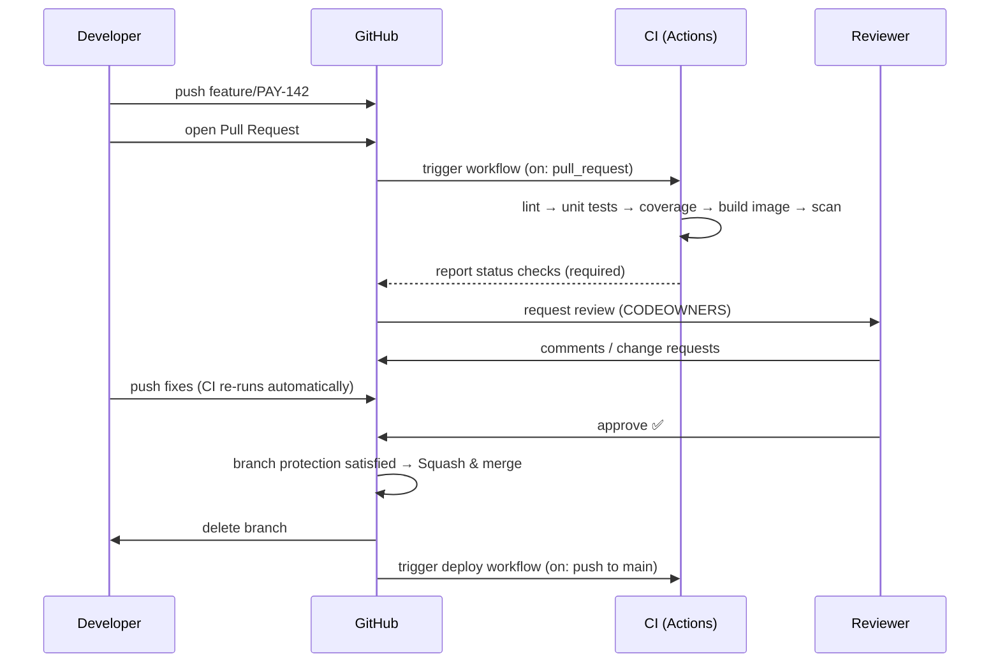

# Module 2 — Version Control and Continuous Integration

> **Days 1–2 · ~120 minutes of lecture · Labs 02, 03, 04, 05**
>
> **Learning outcomes.** You can explain Git's internal object model well enough to reason
> about any command; say what each everyday command does before you run it; choose and
> justify a branching strategy; explain what each merge strategy does to history; rebase a
> branch, resolve a rebase conflict and undo a rebase — and know when not to rebase; run an
> effective pull-request process; state the rules that make Continuous Integration
> *actually* CI; and build the same pipeline in both GitHub Actions and Jenkins.

---

## 2.1 Why version control is the foundation of everything

Every other practice in this course depends on one property: **the state of the system is
described by files, and those files are versioned.** Source code, pipelines, infrastructure,
Kubernetes manifests, dashboards, alert rules, security policy — all of it.

> **Version Control System (VCS)** — a system that records changes to a set of files over
> time so that you can recall any specific version, see who changed what and why, and work
> concurrently without overwriting each other.

| Generation | Example | Model | Weakness |
|---|---|---|---|
| Local | RCS, SCCS | Versions on one disk | No collaboration |
| Centralised (CVCS) | CVS, Subversion, Perforce | One server holds history; clients hold a working copy | Server is a single point of failure; branching is expensive; offline work impossible |
| **Distributed (DVCS)** | **Git**, Mercurial | **Every clone is a full repository with complete history** | Steeper mental model |

Git won because branching is cheap (it is a 41-byte file), history is content-addressed and
tamper-evident, and every developer has the full history locally so almost every operation
is a local disk operation.

### The four things version control buys a DevOps team

1. **A single source of truth** — the answer to "what is running?" is a git SHA.
2. **Auditability** — who changed what, when and why, cryptographically chained.
3. **Reversibility** — any state can be recreated; rollback is `git revert` plus a redeploy.
4. **A trigger** — CI/CD systems are event-driven off repository events. No VCS, no pipeline.

---

## 2.2 Git's object model — the part that makes every command make sense

Git is a **content-addressable filesystem** with a version-control interface on top. There
are exactly four object types, all stored in `.git/objects`, all named by the SHA-1 (or
SHA-256) hash of their contents.

| Object | Contains | Analogy |
|---|---|---|
| **blob** | The raw bytes of a file. No name, no permissions. | A file's *content* |
| **tree** | A list of (mode, type, hash, name) entries pointing at blobs and other trees | A *directory* |
| **commit** | One tree hash + zero-or-more parent commit hashes + author + committer + message | A *snapshot* + its lineage |
| **tag** | A pointer to an object, with a name, message and optional signature | An annotated *label* |

```
              ┌──────────────────────────────────────────────────┐
  refs/heads/main ──────────────────────► commit c3                │
                                            │  tree: t3            │
                                            │  parent: c2 ─────┐   │
                                            └──────────────────┼───┘
                                                               ▼
                                                        commit c2
                                                          tree: t2
                                                          parent: c1 ──► commit c1
                                                                            tree: t1
                                                                            parent: (none)

        tree t3 ──┬── blob  "README.md"   (hash a1b2…)
                  ├── blob  "wsgi.py"     (hash 9f3e…)
                  └── tree  "src/"  ──┬── blob "app.py"    (hash 44cd…)
                                      └── blob "config.py" (hash 77ef…)
```

Three consequences you should be able to recite:

1. **A branch is just a movable pointer to a commit** — literally a file in
   `.git/refs/heads/` containing 41 bytes. This is why creating a branch is instant, and
   why "we don't branch, it's expensive" is a Subversion-era belief.
2. **History is a Directed Acyclic Graph (DAG)**, not a line. A merge commit simply has two
   parents.
3. **Commits are immutable.** `git commit --amend`, `rebase` and `cherry-pick` do not edit
   commits — they create *new* commits with new hashes. This is why force-pushing a shared
   branch is destructive: you replace commits other people already have.

### `HEAD`, and what "detached HEAD" really means

`HEAD` is a pointer to *the branch you are currently on* (normally the text
`ref: refs/heads/main`). If you `git checkout <sha>`, HEAD points directly at a commit
instead of at a branch — **detached HEAD**. Commits made there belong to no branch and are
garbage-collected eventually. The fix is always `git switch -c <new-branch>`.

---

## 2.3 The three (really four) areas

```
 ┌──────────────┐   git add    ┌──────────────┐  git commit  ┌──────────────┐   git push   ┌──────────────┐
 │   WORKING    │ ───────────► │    INDEX     │ ───────────► │    LOCAL     │ ───────────► │    REMOTE    │
 │     TREE     │              │  (staging    │              │  REPOSITORY  │              │  REPOSITORY  │
 │ files on disk│ ◄─────────── │   area)      │ ◄─────────── │  .git/       │ ◄─────────── │  (GitHub)    │
 └──────────────┘  git restore └──────────────┘  git reset   └──────────────┘  git fetch   └──────────────┘
                                                                                            git pull = fetch + merge
```

| Area | What lives there | Inspect with |
|---|---|---|
| **Working tree** | The files you edit | `git status`, `git diff` |
| **Index / staging area** | The *proposed next commit* | `git status`, `git diff --staged` |
| **Local repository** | The full object database and refs | `git log`, `git show` |
| **Remote repository** | The shared copy on GitHub | `git remote -v`, `git log origin/main` |

The staging area is Git's most misunderstood feature and its best one: it lets you commit
*part* of your working changes, so each commit can be a single logical change even when you
have been working on three things at once (`git add -p`).

### File states

```
 untracked ──git add──► staged ──git commit──► committed/unmodified ──edit──► modified ──git add──► staged
      ▲                                                                                       │
      └──────────────────────────── git rm --cached ─────────────────────────────────────────┘
```

### Everyday commands, and what each one means

> **Every command in full** — what it means, real output, when to use it, when not to, and what
> to watch for — is in the **[Git Command Guide](git-command-guide.md)** (init · clone · status ·
> diff · add · rm · mv · commit · log · show · blame · branch · switch · remote · fetch · pull ·
> push · stash · restore · reset · reflog · revert · cherry-pick · tag · describe · bisect · clean).
> The tables below are the summary.

Every Git command either **looks** at the four areas or **changes** one of them. Knowing which
kind a command is tells you how careful to be before you press Enter.

**Commands that only look — safe at any moment**

| Command | What it means | Reach for it when |
|---|---|---|
| `git status` | Which files are modified, staged or untracked — and whether you are in the middle of a merge or rebase | Before and after every other command |
| `git diff` | Edits in the working tree that are **not staged** yet | Checking what you actually changed |
| `git diff --staged` | Exactly what the **next commit** will contain | Every time, just before `git commit` |
| `git log --oneline --graph --decorate --all` | The commit graph: every branch, one line per commit (the `git lg` alias from Lab 02) | Seeing where branches split and joined |
| `git show <sha>` | One commit: author, date, message and full diff | Reviewing a single change |
| `git branch -vv` | Local branches with their upstream and ahead/behind counts | Before a push or a pull |
| `git remote -v` | The named remotes and their URLs — usually just `origin` | Checking where a push will land |
| `git reflog` | Every position `HEAD` has held, including commits no branch points at any more | Recovering after a bad reset or rebase |

**Commands that record and share work**

| Command | What it means | What it changes |
|---|---|---|
| `git switch -c <branch>` | Create a branch at the current commit and move onto it | A new local branch pointer |
| `git add <path>` · `git add -p` | Copy changes into the index — the proposed next commit. `-p` asks hunk by hunk | The index |
| `git commit -m "type: subject"` | Record the index as a new, permanent commit | Local history (adds) |
| `git push -u origin HEAD` | Upload the current branch; `-u` remembers `origin` as its upstream | The remote |
| `git fetch` | Download new commits into `origin/*`. **Your branches and files are untouched** | Remote-tracking refs only |
| `git merge origin/main` | Join `main` into your branch with a merge commit that has two parents | Adds one commit |
| `git rebase origin/main` | Replay your commits on top of `main` as **new** commits | **Rewrites** your branch |
| `git pull` · `git pull --rebase` | `fetch` + `merge`, or `fetch` + `rebase` | Adds, or rewrites |

> **A habit worth keeping:** `git fetch`, look at `git lg`, then merge or rebase *on purpose* —
> instead of a blind `git pull` that combines whatever happened to arrive.

**A normal day, in order**

```bash
git switch main && git pull             # start from the latest main
git switch -c feature/PAY-142           # one branch per change
# ... edit ...
git status                              # WHAT changed?
git diff                                # HOW exactly?
git add -p                              # stage one logical change
git diff --staged                       # last look before recording it
git commit -m "feat: add readiness probe"
git fetch origin                        # has main moved on?
git rebase origin/main                  # replay my work on top of it (see §2.5)
python -m pytest -q                     # test what I am about to push
git push -u origin HEAD                 # publish the branch, open the PR
```

---

## 2.4 Branching strategies

> **Branching strategy** — the agreed convention for how branches are created, named,
> integrated and deleted, and what each branch is allowed to mean.

The strategy is a **team contract**, not a technical constraint. Choosing badly is the most
common cause of "our CI is slow and our merges are painful."

### GitFlow (Vincent Driessen, 2010)

```
 main      ──●────────────────────────●──────────────────────●──►   (production, tagged)
              ╲                      ╱                      ╱
 hotfix        ╲                    ╱      ●──────●────────╱
                ╲                  ╱      ╱
 release         ╲        ●───────●──────╯
                  ╲      ╱
 develop  ──●──────●────●──────●──────●──────────●───────────────►  (integration)
             ╲    ╱      ╲    ╱        ╲        ╱
 feature/x    ●──●         ╲  ╱          ╲     ╱
 feature/y                  ●●            ●───●
```

| | |
|---|---|
| **Branches** | `main`, `develop`, `feature/*`, `release/*`, `hotfix/*` |
| **Use when** | Explicit versioned releases; multiple versions supported in parallel; shipped/installed software; strict regulatory release gates |
| **Avoid when** | You deploy continuously to a single production environment |
| **Cost** | Long-lived branches → large merges → merge hell. Two permanent branches to keep in sync. Slowest feedback of the three. |

> Driessen himself added a note to the original article saying that if you deliver
> continuously to a web app, you should use something simpler. Quote it when someone
> insists on GitFlow for a SaaS product.

### GitHub Flow

```
 main  ──●────●────●──────●────●────●──►  (always deployable; deploy on every merge)
          ╲  ╱      ╲    ╱      ╲  ╱
 feature   ●●        ●──●        ●●
           short-lived (hours to 2 days), PR-reviewed, CI-gated
```

| | |
|---|---|
| **Branches** | `main` + short-lived branches |
| **Rules** | `main` is always deployable · branch for every change · open a PR early · merge only when CI is green and reviewed · deploy immediately after merge |
| **Use when** | Web services, single production version, continuous deployment |
| **Cost** | Requires genuinely good automated tests; no natural place to stabilise a release |

**This is the strategy the course uses**, because it is the one that fits CI/CD.

### GitLab Flow

GitHub Flow plus **environment branches** (`main` → `staging` → `production`) or
**release branches** for versioned products. Promotion is a merge from one environment
branch to the next, which gives you an auditable promotion trail — useful in regulated
environments that want CD but need evidence.

### Trunk-Based Development

```
 main  ─●─●─●─●─●─●─●─●─●─●─●─●─►   everyone commits here, at least daily
          ╲│╱   ╲│╱
        branches live < 24 h (or nobody branches at all)
        incomplete work hidden behind FEATURE FLAGS
```

| | |
|---|---|
| **Rules** | Branches live under 24 hours; commit to trunk at least daily; incomplete features hidden behind feature flags; trunk must always be releasable |
| **Use when** | You want the highest delivery performance and have the test automation to support it |
| **Cost** | Demands strong CI, feature flags, and discipline. Painful without them. |

**DORA's finding:** trunk-based development — defined as fewer than three active branches,
branches living under a day, and no code freezes — is one of the strongest *predictors* of
high delivery performance.

### Choosing — a decision table

| Question | GitFlow | GitHub Flow | Trunk-based |
|---|---|---|---|
| Do you support multiple released versions simultaneously? | ✅ | ❌ | ❌ |
| Do you deploy to one production environment continuously? | ❌ | ✅ | ✅ |
| Is your automated test suite trustworthy? | not required | required | essential |
| Do you have feature flags? | not required | helpful | essential |
| Typical branch lifetime | weeks | hours–days | hours |
| Merge pain | high | low | near zero |

### Naming and hygiene

```
feature/PAY-142-add-readiness-probe      type/ticket-short-description
bugfix/PAY-158-null-latency
hotfix/PAY-160-crash-on-empty-body
chore/bump-flask-3.0.3
```

Rules that prevent most pain: lowercase-with-hyphens, include the ticket ID, **delete the
branch after merge**, and never commit directly to a protected branch.

---

## 2.5 Merge strategies — what each one does to history

This is where most teams argue, usually without knowing what the options actually do.

### 1. Fast-forward merge

Possible only when the target branch has **no new commits** since the branch point. Git
just moves the pointer forward. No merge commit is created.

```
 before:   main ──A──B                after:   main ──A──B──C──D
                      ╲                                      ▲
           feature      C──D                        (main pointer moved)
```
`git merge --ff-only feature` — fails loudly if a fast-forward is not possible, which makes
it a good safety flag in scripts.

### 2. Three-way merge (merge commit)

Target has moved on. Git finds the **merge base** (common ancestor), compares both sides
against it, and creates a commit with **two parents**.

```
 before:   main ──A──B──E──F          after:   main ──A──B──E──F──M
                      ╲                                  ╲        ╱
           feature     C──D                               C──────D
                                                    M = merge commit (parents F and D)
```
| | |
|---|---|
| ✅ | True history preserved; nothing is rewritten; safe on shared branches; `git revert -m 1 M` undoes the whole feature |
| ❌ | Graph becomes noisy ("railway lines"); `git log` on a busy repo is hard to read |
| Use | Long-lived branches, release merges, any shared branch |

### 3. Squash merge

All the branch's commits are combined into **one new commit** on the target. The branch's
individual commits are not carried over.

```
 before:   main ──A──B                after:   main ──A──B──S
                      ╲                            S contains C+D+E as one commit
           feature     C──D──E
```
| | |
|---|---|
| ✅ | One tidy commit per feature; `main` history reads like a changelog; hides "wip", "fix typo", "actually fix typo" |
| ❌ | Loses intermediate history; `git bisect` granularity is coarser; the source branch now looks unmerged, so **always delete it** |
| Use | **Default for PRs in GitHub Flow** — this is what the course uses |

### 4. Rebase (and rebase-and-merge)

Replays your commits **on top of** the target branch, creating new commits with new hashes.
History becomes linear.

```
 before:   main ──A──B──E──F          after rebase:  main ──A──B──E──F──C'──D'
                      ╲                                    C' and D' are NEW commits
           feature     C──D                                (different SHAs to C and D)
```
| | |
|---|---|
| ✅ | Perfectly linear, readable history; no merge commits; each commit still individually testable |
| ❌ | **Rewrites history.** Requires force-push. Conflicts may need resolving repeatedly (once per replayed commit). |
| Use | Cleaning up **your own** un-pushed branch before opening a PR |

### 🔴 The Golden Rule of Rebasing

> **Never rebase commits that exist outside your repository and that others may have based
> work on.**

Rebasing a shared branch replaces commits everyone else already has, and their next `pull`
produces duplicated commits and phantom conflicts. If you must force-push your *own* PR
branch, use `git push --force-with-lease`, which refuses if the remote moved since you last
fetched — it protects a colleague who pushed to your branch.

### Which to choose

| Situation | Strategy |
|---|---|
| Merging a reviewed PR into `main` (GitHub Flow) | **Squash** |
| Merging a release branch into `main` (GitFlow) | **Merge commit** (never squash a release) |
| Bringing `main`'s latest into your own open PR branch | **Rebase** (yours alone) or merge if others share it |
| Any branch that other people have pulled | **Merge commit only** |

### Rebase in practice — what it means, how to do it, when to use it

> **Rebase** — moving the starting point (the *base*) of your branch. Git sets your commits
> aside, moves to the new base, and replays each commit on top of it, creating **new commits
> with new SHAs**.

The name is literal: your branch used to start at an old `main` commit; after `git rebase
origin/main` it starts at the tip of today's `main`. Each replayed commit carries the same
change but has a different parent — and because a commit's SHA covers its parent, every
replayed commit gets a new SHA. Everything about when rebasing is safe follows from that one
fact.

#### The same branch, merged and rebased

Real output from one repository. A colleague pushed a fix to `main` while you had two commits
on `feature/PAY-142`:

```
# before: the branch and main have diverged
* f1c7cab (HEAD -> feature/PAY-142, origin/feature/PAY-142) docs: explain readiness
* f7c4490 feat: add readiness probe
| * 6fcdcba (origin/main, origin/HEAD) fix: raise settlement timeout
|/
* 039ad72 (main) feat: add PayTrack API service

# option 1:  git merge origin/main
*   a15f32e Merge remote-tracking branch 'origin/main' into feature/PAY-142
|\
| * 6fcdcba fix: raise settlement timeout
* | f1c7cab docs: explain readiness
* | f7c4490 feat: add readiness probe
|/
* 039ad72 feat: add PayTrack API service

# option 2:  git rebase origin/main
* a39d691 docs: explain readiness
* 0b25573 feat: add readiness probe
* 6fcdcba fix: raise settlement timeout
* 039ad72 feat: add PayTrack API service
```

The files are identical in both outcomes. The merge **adds** `a15f32e` and leaves your
commits untouched; the rebase **replaces** `f7c4490`/`f1c7cab` with `0b25573`/`a39d691`.

#### How to rebase your branch onto the latest `main`

```bash
git switch feature/PAY-142
git fetch origin                 # get the latest shared main
git rebase origin/main           # replay your commits on top of it
python -m pytest -q              # the replayed commits are untested combinations - test them
git push --force-with-lease      # the branch was rewritten, so a plain push is rejected
```

What you see:

```
$ git fetch origin
   039ad72..6fcdcba  main       -> origin/main
$ git rebase origin/main
Successfully rebased and updated refs/heads/feature/PAY-142.
$ git push
 ! [rejected]        feature/PAY-142 -> feature/PAY-142 (non-fast-forward)
hint: use 'git pull' before pushing again.
$ git push --force-with-lease
 + f1c7cab...a39d691 feature/PAY-142 -> feature/PAY-142 (forced update)
```

> ⚠️ **Do not follow the `git pull` hint after a rebase.** The remote still holds your *old*
> commits; pulling merges them back in and every commit on the branch appears twice. Push your
> own rebased branch with `--force-with-lease`, which refuses if anyone else pushed to it
> since your last fetch — unlike `--force`, which silently overwrites their work.

`git pull --rebase` does `fetch` + `rebase` in one step. It is the right way to pick up
commits you pushed from another machine to *your own* branch, without creating a pointless
"Merge branch" commit. (Lab 00 sets `pull.rebase false`, so plain `git pull` merges unless you
ask for `--rebase`.)

#### When a rebase stops for a conflict

A rebase replays commits one at a time, so a conflict stops it at a specific commit:

```
$ git rebase origin/main
Rebasing (1/4)
CONFLICT (content): Merge conflict in app/src/config.py
error: could not apply d92986f... feat: raise settlement timeout to 60s
$ git status
interactive rebase in progress; onto 02cf66b
  (fix conflicts and then run "git rebase --continue")
  (use "git rebase --skip" to skip this patch)
  (use "git rebase --abort" to check out the original branch)
$ cat app/src/config.py
<<<<<<< HEAD
TIMEOUT = 45
=======
TIMEOUT = 60
>>>>>>> d92986f (feat: raise settlement timeout to 60s)
```

| Command | Does |
|---|---|
| edit the file, then `git add <file>` | Marks this commit's conflict as resolved |
| `git rebase --continue` | Finishes this commit and replays the next one. **Do not** run `git commit` mid-rebase |
| `git rebase --skip` | Drops *this* commit entirely — only when `main` already contains the same change |
| `git rebase --abort` | Puts the branch back exactly as it was before the rebase started |

> 🔄 **`HEAD` means the other side during a rebase.** In a merge, `HEAD` is your branch. In a
> rebase, `HEAD` is the branch you are rebasing *onto* plus the commits replayed so far; the
> lower half of the conflict (`>>>>>>> d92986f`) is **your** commit. Read the label after
> `>>>>>>>` before deciding which side to keep.

Because commits are replayed individually, you may resolve the same region more than once.
If that happens often on long-lived branches, turn on `git config --global rerere.enabled
true` ("reuse recorded resolution"), which replays a resolution you have already made.

#### Interactive rebase — tidy the branch before review

`git rebase -i <base>` turns the replay into a plan you can edit. It opens your editor with
one line per commit, **oldest first** (the reverse of `git log`):

```
$ git log --oneline
eb5906b fix typo
0f428b6 wip
15d34da feat: add readiness probe
080168c feat: raise settlement timeout to 60s
$ git rebase -i main
```

```
pick 080168c feat: raise settlement timeout to 60s
pick 15d34da feat: add readiness probe
pick 0f428b6 wip
pick eb5906b fix typo
```

Edit the plan — change verbs, move lines — then save and close:

```
pick  080168c feat: raise settlement timeout to 60s
fixup 0f428b6 wip
fixup eb5906b fix typo
pick  15d34da feat: add readiness probe
```

```
Successfully rebased and updated refs/heads/feature/PAY-150-raise-timeout.
$ git log --oneline
3dafa34 feat: add readiness probe
51d5488 feat: raise settlement timeout to 60s
```

| Verb | Does |
|---|---|
| `pick` | Keep the commit as it is |
| `reword` | Keep the change, edit the message |
| `edit` | Stop after this commit so you can amend it |
| `squash` | Meld into the commit above and **combine** the messages |
| `fixup` | Meld into the commit above and **discard** this message |
| `drop` | Delete the commit |

**The shortcut:** make follow-up commits with `git commit --fixup <sha>`; later,
`git rebase -i --autosquash main` moves each `fixup!` commit under its target and marks it
`fixup` for you.

#### Undoing a rebase

Nothing a rebase does in your own clone is permanent. Git records where the branch was:

```
$ git reflog -5
a39d691 HEAD@{0}: rebase (finish): returning to refs/heads/feature/PAY-142
a39d691 HEAD@{1}: rebase (pick): docs: explain readiness
0b25573 HEAD@{2}: rebase (pick): feat: add readiness probe
6fcdcba HEAD@{3}: rebase (start): checkout origin/main
f1c7cab HEAD@{4}: commit: docs: explain readiness
$ git reset --hard ORIG_HEAD
HEAD is now at f1c7cab docs: explain readiness
```

- **`ORIG_HEAD`** points at the branch tip from before the rebase, so `git reset --hard
  ORIG_HEAD` undoes the whole rebase in one step.
- Once `ORIG_HEAD` has moved on (another reset, merge or rebase), use the **reflog**: the line
  just below `rebase (start)` is your old tip — `git reset --hard HEAD@{4}` here.
- `--hard` discards uncommitted edits, so commit or stash first. The reflog lives only in your
  clone and expires (about 90 days by default).

#### When to rebase — and when not to

| Situation | Rebase? | Why |
|---|---|---|
| Your own branch, not pushed yet | ✅ Yes | Nobody else has these commits — rewrite freely |
| Your own PR branch, and `main` has moved on | ✅ Yes, then `--force-with-lease` | The author, who knows the code, resolves the conflicts |
| "wip" and "fix typo" commits before review | ✅ Yes — `rebase -i` | Reviewers read a clean story; every commit builds |
| Pulling your own branch after pushing from a second machine | ✅ `git pull --rebase` | No pointless "Merge branch" commit |
| A branch a colleague has pulled or pushed to | ❌ No — merge | Rewriting it breaks their copy; agree first if you must |
| Review is under way on the PR | ❌ Prefer new commits | Reviewers lose "what changed since I last looked" |
| `main`, `develop`, `release/*` | ❌ Never | Shared history — branch protection should block force-push |
| The team squash-merges every PR | Optional | `main` gets one commit per PR either way |

> **Rule of thumb:** rebase to tidy and update **your** work; merge to combine **shared** work.

### Merge conflicts

A conflict occurs when both sides changed **the same region of the same file**, and Git
cannot decide. Git is not broken; it is asking a question.

```
<<<<<<< HEAD                    ← what is on the branch you are merging INTO
    timeout = 30
=======                         ← divider
    timeout = 60
>>>>>>> feature/raise-timeout   ← what is on the branch you are merging FROM
```

Resolution = edit the file so it is correct (usually neither side verbatim), delete all
three markers, `git add` the file, then `git commit` (or `git rebase --continue`).
`git merge --abort` / `git rebase --abort` always gets you back to safety. During a rebase the
sides are swapped — see *Rebase in practice* above.

You will deliberately create and resolve a conflict in **Lab 03**.

---

## 2.6 Pull requests and code review

> 🏦 **In a bank, the pull request *is* your segregation-of-duties control.** Branch
> protection with required approvals and self-approval disabled means the **system**, not a
> policy document, makes it impossible to merge your own change into production. That is a
> stronger control than a separate release team — it applies to 100 % of changes rather than
> to those that reached a meeting agenda, and it generates its own audit evidence (approver
> identity, timestamp, the immutable merge commit). See
> [Appendix A §A.3](appendix-a-devops-in-a-regulated-bank.md#a3-segregation-of-duties-without-a-manual-gate).

> **Pull Request (PR)** / **Merge Request (MR)** — a request to merge a branch, which
> creates a durable place to run automated checks, hold a review conversation, and record
> the decision.

A PR is three things at once: a **quality gate** (CI must pass), a **knowledge-transfer
mechanism** (a second person learns the change) and an **audit record** (who approved what,
and when — often the artefact your auditor actually wants).

### The lifecycle



### What makes review effective (and what makes it theatre)

| Do | Don't |
|---|---|
| Keep PRs **under ~400 lines changed** — defect-detection collapses beyond that | Open a 4 000-line "refactor + feature" PR |
| Review within **24 hours** — an idle PR is pure wait time in the value stream | Let PRs age for a week |
| Automate the boring parts (formatting, lint, coverage) so humans review **design** | Argue about brace style in review comments |
| Ask questions rather than issue orders: "What happens if `target` is empty?" | "This is wrong." |
| Use a **PR template** and a **CODEOWNERS** file for automatic routing | Rely on someone noticing |
| Approve *and* merge — a PR approved but not merged is still WIP | Treat approval as the end |

### Branch protection — turning convention into enforcement

On `main`, enable: require a PR before merging · require N approvals · require status
checks to pass · require branches to be up to date · dismiss stale approvals on new
commits · require conversation resolution · restrict force-push and deletion · (optionally)
require signed commits.

**Without branch protection, a branching strategy is a suggestion.** You will configure
this in Lab 03.

---

## 2.7 Continuous Integration — the principles

> **Continuous Integration** — the practice where every member of the team integrates their
> work into the mainline **at least daily**, and every integration is verified by an
> **automated build and test run**, so that integration problems are detected within
> minutes rather than at the end of a project.

The definition is Grady Booch's term with Kent Beck's and Martin Fowler's rules. Note what
it requires: *integration into the mainline*, *daily*, *automated verification*. A team with
three-week feature branches and a nightly build is **not** doing CI, no matter what their
Jenkins server is called.

### The CI test — answer honestly

1. Does everyone push to the mainline at least once a day?
2. Does every push trigger an automated build and test run?
3. When the build breaks, is fixing it the team's **top priority**?

Three yeses = CI. Anything less is "we have a build server."

### The rules

| Rule | Why |
|---|---|
| **Maintain a single source repository** | One place to look; one thing to trigger from |
| **Automate the build** | One command builds everything from a clean checkout |
| **Make the build self-testing** | A build that compiles but is untested proves nothing |
| **Everyone commits to mainline daily** | Bounds the size of any integration problem |
| **Every commit builds the mainline** | Someone must actually be responsible for the result |
| **Fix broken builds immediately** | A red mainline blocks everyone; it is a *stop-the-line* event |
| **Keep the build fast** | Target **under 10 minutes**. Beyond that, people stop waiting for it and start batching. |
| **Test in a clone of production** | Environmental differences are the most expensive class of bug — this is why we containerise on day 3 |
| **Make it easy to get the latest build** | Artefacts published, versioned, discoverable |
| **Everyone can see the build state** | A visible red/green signal, not a buried email |
| **Automate deployment** | The pipeline ends in production, not in a hand-off |

### The build pipeline and the feedback-cost curve

```
 COMMIT STAGE (target: < 5 min)        ACCEPTANCE (< 20 min)       PROD-LIKE
 ┌───────────────────────────────┐    ┌────────────────────┐    ┌──────────────┐
 │ compile / install deps        │    │ integration tests  │    │ deploy stage │
 │ static analysis / lint        │───►│ contract tests     │───►│ smoke tests  │───► deploy prod
 │ unit tests (+coverage)        │    │ security scans     │    │ perf tests   │
 │ package artefact ONCE         │    │ image scan / SBOM  │    │              │
 └───────────────────────────────┘    └────────────────────┘    └──────────────┘
      cost of a defect found here:  £        ££            £££           ££££  … £££££ in prod
```

**Build the artefact exactly once**, in the commit stage, and **promote that same artefact**
through every later stage. Rebuilding per environment means you test one binary and ship a
different one — the single most common way a "fully tested" release still breaks in
production.

### The test pyramid

```
                    ╱╲          E2E / UI          few · slow (min) · brittle · expensive
                   ╱  ╲         ~5 %
                  ╱────╲        Integration       some · medium (sec) · real dependencies
                 ╱      ╲       ~15 %
                ╱────────╲      Unit              many · fast (ms) · isolated · cheap
               ╱__________╲     ~80 %
```

Invert it and you get the **ice-cream cone anti-pattern**: mostly slow, flaky UI tests, a
30-minute pipeline nobody trusts, and re-runs used as a coping mechanism. PayTrack API's suite
is deliberately at the base of the pyramid — it needs no database and runs in under a
second, which is what lets the pipeline stay under 10 minutes.

---

## 2.8 Build automation

> **Build automation** — the practice of scripting the transformation of source code into a
> deployable artefact so that it can be executed identically by any person or machine, from
> a clean checkout, with a single command.

Properties a build must have:

| Property | Meaning | How we achieve it in this course |
|---|---|---|
| **Reproducible** | Same source → same artefact | Pinned dependency versions in `requirements.txt`; pinned base image digests |
| **Hermetic** | Depends only on declared inputs | Build inside a container; no reliance on what happens to be installed |
| **Fast** | Under 10 minutes | Layer caching, dependency caching, parallel jobs |
| **Self-testing** | Fails on a defect | `pytest` runs in the same command |
| **Versioned** | Every artefact is uniquely identified | Tag images with the **git SHA**, not `latest` |

### Semantic versioning, and why we tag with the SHA anyway

`MAJOR.MINOR.PATCH` — MAJOR for breaking changes, MINOR for backwards-compatible features,
PATCH for backwards-compatible fixes. Use SemVer for **released artefacts consumers depend
on** (libraries, APIs).

For **deployable images**, tag with the immutable commit SHA (`paytrack-api:9f3e2a1`) and add
moving tags (`:1.4.2`, `:main`) as *aliases*. `latest` in a deployment manifest is an
outage waiting for a quiet week: it is unpinned, unreproducible, and makes rollback
ambiguous.

---

## 2.9 Jenkins

> **Jenkins** — an open-source, self-hosted automation server. Extremely extensible
> (~1 900 plugins), controller/agent architecture, pipelines defined as code in a
> `Jenkinsfile`.

### Architecture

```
                       ┌──────────────────────────────────┐
   Git webhook ───────►│         JENKINS CONTROLLER       │
                       │  • schedules builds              │
                       │  • stores config & build history │
                       │  • serves the UI / API           │
                       │  • SHOULD NOT run builds itself  │
                       └───────┬──────────┬───────────────┘
                     JNLP/SSH  │          │
                ┌──────────────▼──┐   ┌───▼──────────────┐
                │    AGENT  1     │   │   AGENT  2       │
                │ label: linux    │   │ label: docker    │
                │ executors: 2    │   │ executors: 4     │
                └─────────────────┘   └──────────────────┘
                          builds actually run here
```

The controller should never execute builds: a malicious or buggy build running on the
controller has access to every credential Jenkins holds. Set the controller's executor
count to **0**.

### Declarative pipeline anatomy

```groovy
pipeline {
    agent any                                   // where to run
    options { timeout(time: 20, unit: 'MINUTES'); disableConcurrentBuilds() }
    environment { IMAGE = "paytrack-api" }          // env vars for all stages
    triggers { pollSCM('H/5 * * * *') }          // or a webhook
    stages {
        stage('Checkout') { steps { checkout scm } }
        stage('Lint')     { steps { sh 'flake8 src tests' } }
        stage('Test')     { steps { sh 'pytest --junitxml=report.xml' } }
        stage('Build')    { steps { sh 'docker build -t $IMAGE:$GIT_COMMIT .' } }
    }
    post {                                       // always runs
        always  { junit 'report.xml' }
        failure { echo 'Build failed — this is a stop-the-line event' }
    }
}
```

| Concept | Meaning |
|---|---|
| `pipeline` | The whole declarative block; must be the outermost element |
| `agent` | Which node/label/container the work runs on |
| `stages` / `stage` | Logical phases; these are what appear in the UI's stage view |
| `steps` | The actual commands |
| `post` | Blocks that run after: `always`, `success`, `failure`, `unstable`, `changed` |
| `environment` | Environment variables, including `credentials('id')` injection |
| **Declarative vs Scripted** | Declarative = structured, validated, readable — use this. Scripted = raw Groovy, unlimited power, unlimited rope. |

### When Jenkins is the right answer

✅ You must run builds inside your own network, on your own hardware, or against hardware
that cannot be reached from the internet. ✅ You need something a hosted runner cannot do.
✅ You already run it and it works.

❌ Otherwise, be honest about the total cost: a Jenkins controller is a stateful,
security-sensitive server that needs patching, backup, plugin management and an upgrade
strategy. "Free" is a licence statement, not a cost statement.

---

## 2.10 GitHub Actions

> **GitHub Actions** — CI/CD built into GitHub. Workflows are YAML files in
> `.github/workflows/`, triggered by repository events, executed on GitHub-hosted or
> self-hosted runners.

### Hierarchy

```
 EVENT (push, pull_request, schedule, workflow_dispatch, release, …)
   └── WORKFLOW           one YAML file in .github/workflows/
         └── JOB          runs on one runner; jobs are PARALLEL unless `needs:` is set
               └── STEP   sequential inside a job
                     └── `run:` a shell command   OR   `uses:` a reusable Action
```

### Annotated example

```yaml
name: CI                                   # shown in the Actions tab
on:                                        # WHAT TRIGGERS THIS
  push:        { branches: [main] }
  pull_request:{ branches: [main] }
permissions:                               # least privilege for GITHUB_TOKEN
  contents: read
jobs:
  test:
    runs-on: ubuntu-24.04                  # GitHub-hosted runner image
    steps:
      - uses: actions/checkout@v4          # clone the repo into the runner
      - uses: actions/setup-python@v5      # install a specific Python
        with: { python-version: '3.12', cache: 'pip' }
      - run: pip install -r app/requirements-dev.txt
      - run: flake8 app/src app/tests      # any non-zero exit fails the job
      - run: pytest --cov=src --cov-report=xml
      - uses: actions/upload-artifact@v4   # keep the results
        if: always()                       # even when the previous step failed
        with: { name: coverage, path: coverage.xml }
```

| Concept | Meaning |
|---|---|
| **Runner** | The VM/container executing a job. GitHub-hosted (`ubuntu-24.04`) or self-hosted |
| **Action** | A reusable unit referenced with `uses: owner/repo@ref`. **Always pin to a version or SHA** — `@main` means an outsider can change what runs in your pipeline |
| `needs:` | Declares job dependencies, turning parallel jobs into a DAG |
| `strategy.matrix` | Runs the same job across combinations (e.g. Python 3.11 / 3.12) |
| **Secrets** | `${{ secrets.NAME }}` — encrypted, masked in logs, never exposed to PRs from forks |
| `GITHUB_TOKEN` | An automatically-provisioned, short-lived token scoped by `permissions:` |
| **OIDC** | Exchange a short-lived GitHub identity token for cloud credentials — no long-lived secrets |
| **Concurrency** | `concurrency: { group: ..., cancel-in-progress: true }` stops wasteful duplicate runs |

### Jenkins vs GitHub Actions — an honest comparison

| | **Jenkins** | **GitHub Actions** |
|---|---|---|
| Hosting | Self-hosted, you operate it | Hosted (self-hosted runners optional) |
| Config | `Jenkinsfile` (Groovy) | YAML in `.github/workflows/` |
| Setup effort | Hours to days | Minutes |
| Ecosystem | ~1 900 plugins, variable quality | Marketplace Actions, variable quality |
| Cost model | Free licence + real infra & staff cost | Free for public repos; 2 000 min/mo private on Free |
| Secrets | Credentials plugin | Encrypted secrets + OIDC |
| Best at | Complex, legacy, air-gapped, hardware-in-the-loop | Anything already living on GitHub |
| Main risk | Plugin sprawl, an unpatched controller, snowflake config | Vendor coupling; supply-chain risk from unpinned Actions |

You will build the **same pipeline in both** (Labs 04 and 05) so you can judge from
experience rather than from marketing.

---

## 2.11 Key terms

| Term | Definition |
|---|---|
| **Repository** | A project's full history and object database |
| **Commit** | An immutable snapshot of the tree plus its parents and metadata |
| **Branch** | A movable pointer to a commit |
| **HEAD** | Pointer to the currently checked-out branch (or commit, if detached) |
| **Index / staging area** | The proposed contents of the next commit |
| **Remote** | A named reference to another copy of the repository (`origin`) |
| **Fetch / Pull** | Fetch downloads objects; pull = fetch + merge (or + rebase) |
| **Merge base** | The most recent common ancestor of two branches |
| **Fast-forward** | Moving a branch pointer forward with no merge commit |
| **Squash merge** | Combining a branch's commits into one new commit on the target |
| **Rebase** | Replaying commits onto a new base, creating new commits |
| **Interactive rebase** | `git rebase -i`: an editable replay plan — reorder, squash, fixup, reword, drop |
| **ORIG_HEAD** | Where the branch tip was before the last reset, merge or rebase |
| **Reflog** | The local log of every position `HEAD` has held; the safety net for undoing rewrites |
| **Upstream** | The remote branch a local branch tracks (`git push -u`), used by bare `push` and `pull` |
| **Force-with-lease** | A force-push that aborts if the remote moved unexpectedly |
| **Pull request** | A reviewable, gateable proposal to merge |
| **Branch protection** | Server-side rules enforcing review and status checks |
| **CODEOWNERS** | File mapping paths to required reviewers |
| **CI** | Daily mainline integration verified by an automated build |
| **Commit stage** | The fast first pipeline stage; builds the artefact once |
| **Artefact promotion** | Moving one built artefact through environments unchanged |
| **Runner / Agent** | The machine executing pipeline work |
| **Pipeline as code** | Pipeline definition versioned alongside the source it builds |

---

## 2.12 Module 2 self-check

1. Explain why creating a Git branch is O(1) regardless of repository size.
2. A colleague rebased and force-pushed `main`. Describe what breaks for everyone else, and
   how you would recover.
3. Your PR branch is three commits behind `main`. Give the commands to rebase it and publish
   it, explain why a plain `git push` is then rejected, and say how you would undo the rebase.
4. Your team squash-merges PRs. What capability have you traded away, and what have you
   gained?
5. Your build takes 45 minutes. Name three specific consequences, and three things you
   would do first.
6. Why must the artefact be built once and promoted, rather than rebuilt per environment?
7. Your pipeline uses `uses: some-org/deploy-action@main`. State the risk in one sentence
   and the fix in one sentence.
8. A team has a Jenkins server, feature branches lasting three weeks, and a nightly build.
   Are they doing CI? Justify your answer against the three-question test.

---

**Next:** [Module 3 — Containers with Docker](module-03-containers-with-docker.md)
· Labs: [02](../../labs/lab-02-git-fundamentals/README.md) ·
[03](../../labs/lab-03-branching-and-collaboration/README.md) ·
[04](../../labs/lab-04-github-actions-ci/README.md) ·
[05](../../labs/lab-05-jenkins-ci/README.md)
