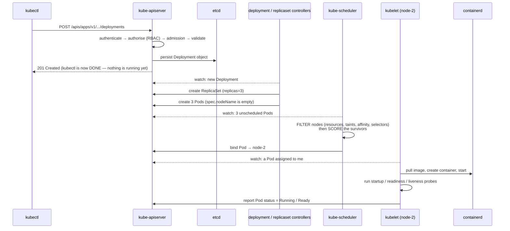

# Module 4 — Kubernetes for DevOps

> **Day 4 · ~85 minutes of lecture · Labs 09, 10, 11, 12**
>
> **Learning outcomes.** You can describe the control plane and node components and what
> each one does during a deploy; explain the reconciliation loop that underlies every
> Kubernetes behaviour; write and debug Pod, Deployment, Service, ConfigMap, Secret, PVC
> and Ingress manifests; reason about rollout and rollback mechanics; and configure
> horizontal autoscaling.

---

## 4.1 Why an orchestrator

Compose gave you a reproducible stack on **one host**. Production adds requirements Compose
structurally cannot meet:

| Requirement | Compose | Kubernetes |
|---|---|---|
| A node dies at 03:00 — workloads move | ✗ | ✓ reschedules automatically |
| Roll out a new version with zero downtime | ✗ | ✓ rolling update with surge/unavailable control |
| Roll back in seconds | ✗ | ✓ `kubectl rollout undo` |
| Scale on CPU or custom metrics | ✗ | ✓ HorizontalPodAutoscaler |
| Bin-pack workloads across a fleet | ✗ | ✓ the scheduler |
| Stable network identity as pods come and go | ✗ | ✓ Services |
| Restart a container that is running but wedged | ✗ | ✓ liveness probes |
| Declarative, self-healing desired state | ✗ | ✓ controllers |

> **Kubernetes** — an open-source platform for automating the deployment, scaling and
> operation of containerised workloads, in which you declare a **desired state** and a set
> of **controllers** continuously act to make the observed state match it.

The word to hold on to is **declarative**. You do not tell Kubernetes to start a container.
You tell it "there should be four healthy replicas of this image," and a controller makes
that true — now, and after a node failure at 03:00, and after you scale the cluster.

### The reconciliation loop — the single idea behind everything

```
        ┌──────────────────────────────────────────────────────────────┐
        │                                                              │
        ▼                                                              │
  ┌───────────┐    observe    ┌────────────┐   compare    ┌──────────────────┐
  │  DESIRED  │ ────────────► │  OBSERVED  │ ───────────► │  DIFFERENCE?     │
  │  STATE    │               │   STATE    │              │  → take action   │
  │ (etcd:    │               │ (what is   │              │  (create/delete/ │
  │  your     │               │  actually  │              │   update object) │
  │  YAML)    │               │  running)  │              └────────┬─────────┘
  └───────────┘               └────────────┘                       │
        ▲                                                          │
        └──────────────────────────────────────────────────────────┘
                          repeat forever, every few seconds
```

Every controller — Deployment, ReplicaSet, Node, Job, HPA, Ingress, and any custom
controller you write — is this loop. Once you internalise it, Kubernetes stops being a pile
of nouns: "why did my pod come back after I deleted it?" answers itself.

---

## 4.2 Architecture

```
┌──────────────────────── CONTROL PLANE ────────────────────────────────────────┐
│                                                                               │
│  ┌───────────────┐   The ONLY component that talks to etcd.                   │
│  │ kube-apiserver│ ◄── REST/gRPC ── kubectl, controllers, kubelets, everything │
│  │               │   AuthN → AuthZ (RBAC) → Admission → Validation → Persist   │
│  └───────┬───────┘                                                            │
│          │                                                                    │
│  ┌───────▼───────┐  ┌──────────────────┐  ┌──────────────────────────────┐   │
│  │     etcd      │  │  kube-scheduler  │  │  kube-controller-manager     │   │
│  │ consistent    │  │ picks a NODE for │  │ node · replicaset · deployment│   │
│  │ key-value     │  │ each unscheduled │  │ endpoint · job · serviceaccount│  │
│  │ store =       │  │ Pod (filter then │  │ … each one a reconcile loop   │   │
│  │ SOURCE OF     │  │ score)           │  └──────────────────────────────┘   │
│  │ TRUTH         │  └──────────────────┘  ┌──────────────────────────────┐   │
│  └───────────────┘                        │ cloud-controller-manager     │   │
│                                           │ (LoadBalancers, routes, …)   │   │
│                                           └──────────────────────────────┘   │
└───────────────────────────────────────────────────────────────────────────────┘
                    │  watch / report status
┌───────────────────▼───────────────────────────────────────────────────────────┐
│                              WORKER NODES                                     │
│  ┌──────────────────────────────────────────────────────────────────────┐    │
│  │ kubelet   — the node agent. Watches the API server for Pods assigned  │    │
│  │             to this node, tells the container runtime to run them,    │    │
│  │             runs probes, reports status back. Does NOT read your YAML.│    │
│  ├──────────────────────────────────────────────────────────────────────┤    │
│  │ kube-proxy — programmes iptables/IPVS so Service virtual IPs work     │    │
│  ├──────────────────────────────────────────────────────────────────────┤    │
│  │ container runtime (containerd + runc) — actually starts containers    │    │
│  ├──────────────────────────────────────────────────────────────────────┤    │
│  │ CNI plugin (Flannel, Calico, Cilium) — pod networking & policy        │    │
│  └──────────────────────────────────────────────────────────────────────┘    │
│      ┌────────┐ ┌────────┐ ┌────────┐        Pods scheduled here              │
│      │  Pod   │ │  Pod   │ │  Pod   │                                         │
│      └────────┘ └────────┘ └────────┘                                         │
└───────────────────────────────────────────────────────────────────────────────┘
```

### What happens when you run `kubectl apply -f deployment.yaml`



**The insight to take away:** `kubectl apply` only records intent. Everything after that is
independent controllers reacting to changes. That is why `kubectl apply` returns instantly
and why `kubectl rollout status` exists.

### Namespaces

> **Namespace** — a virtual cluster within a cluster; a scope for object names, RBAC,
> resource quotas and network policy.

Namespaces are **not** a hard security boundary on their own (that needs NetworkPolicy +
RBAC + quotas), but they are the standard unit of separation for teams and environments.
`default`, `kube-system`, `kube-public` and `kube-node-lease` exist from the start. This
course creates `paytrack-dev` and `paytrack-prod`.

---

## 4.3 Pods

> **Pod** — the smallest deployable unit in Kubernetes: one or more containers that share a
> network namespace (one IP, one port space, they reach each other on `localhost`), share
> storage volumes, and are always scheduled, started and terminated together on one node.

```
 ┌─────────────── POD  (IP 10.42.1.7) ────────────────┐
 │  ┌──────────────┐   ┌──────────────────────────┐   │
 │  │ paytrack-api    │   │ sidecar: log shipper      │   │
 │  │ :8080        │◄─►│ reaches app on localhost  │   │
 │  └──────────────┘   └──────────────────────────┘   │
 │        shared: network ns · volumes · lifecycle     │
 │  ┌────────────────────────────────────────────┐    │
 │  │ pause container — holds the namespaces      │    │
 │  └────────────────────────────────────────────┘    │
 └────────────────────────────────────────────────────┘
```

**You almost never create Pods directly.** A bare Pod is not rescheduled if its node dies,
is not replaced if it is deleted, and cannot be rolled out. You create a Deployment, which
creates a ReplicaSet, which creates Pods.

### Container patterns inside a pod

| Pattern | Purpose | Example |
|---|---|---|
| **Sidecar** | Augments the main container | Log shipper, service-mesh proxy, config reloader |
| **Init container** | Runs to completion **before** app containers start | Wait for the DB, run a schema migration, fetch a secret |
| **Ambassador** | Proxies outbound connections | Local connection pooler |
| **Adapter** | Normalises output | Converts app metrics to Prometheus format |

### Probes — the three, and why confusing them causes outages

| Probe | Question | On failure | Get it wrong and… |
|---|---|---|---|
| **startupProbe** | "Has it finished booting?" | Kills the container after `failureThreshold × periodSeconds` | Slow-starting apps get killed in a loop |
| **livenessProbe** | "Is it wedged?" | **Restarts the container** | Pointing it at the DB restarts every pod during a DB blip — a self-inflicted outage |
| **readinessProbe** | "Can it serve traffic now?" | **Removes the pod from Service endpoints** (no restart) | Missing it sends traffic to a pod that is still warming up |

```yaml
startupProbe:   { httpGet: { path: /health, port: 8080 }, failureThreshold: 30, periodSeconds: 2 }
livenessProbe:  { httpGet: { path: /health, port: 8080 }, periodSeconds: 10, failureThreshold: 3 }
readinessProbe: { httpGet: { path: /ready,  port: 8080 }, periodSeconds: 5,  failureThreshold: 2 }
```

**The rule: liveness must not depend on anything external. Readiness should.** This is
exactly why PayTrack API has two separate endpoints — `/health` never touches the database,
`/ready` does.

### Requests and limits

| Field | Meaning | Effect |
|---|---|---|
| `requests.cpu/memory` | Guaranteed minimum; **what the scheduler uses to place the pod** | Too low → node overcommit and eviction |
| `limits.cpu` | Hard ceiling | Exceeding it **throttles** the container (it gets slow) |
| `limits.memory` | Hard ceiling | Exceeding it **OOM-kills** the container (it dies) |

QoS classes follow from these: **Guaranteed** (requests == limits, evicted last),
**Burstable** (requests < limits), **BestEffort** (nothing set, **evicted first**). Never
ship BestEffort to production.

---

## 4.4 ReplicaSets and Deployments

> **ReplicaSet** — a controller that guarantees a specified number of pod replicas matching
> a label selector are running at any time.
>
> **Deployment** — a controller that manages ReplicaSets in order to provide declarative,
> versioned, rollable updates to a set of pods.

```
   Deployment  paytrack-api  (replicas: 3, image :v2)
        │  owns
        ├──────────────► ReplicaSet  paytrack-api-7d4f  (image :v2)  desired 3 ─┐
        │                                                                    ├─► Pod  Pod  Pod
        └──────────────► ReplicaSet  paytrack-api-5b2c  (image :v1)  desired 0 ─┘
                          ↑ kept for rollback history (revisionHistoryLimit)
```

**A Deployment does not update pods. It creates a new ReplicaSet and shifts replicas from
the old one to the new one.** Every concept below follows from that sentence.

### Rolling update mechanics

```yaml
strategy:
  type: RollingUpdate
  rollingUpdate:
    maxSurge: 1          # how many pods ABOVE `replicas` may exist during the roll
    maxUnavailable: 0    # how many below `replicas` may be unavailable — 0 = zero-downtime
```

With `replicas: 3, maxSurge: 1, maxUnavailable: 0`:

```
 step 0   v1 v1 v1                       3 available
 step 1   v1 v1 v1 v2(starting)          surge to 4; wait for v2 READY
 step 2   v1 v1     v2                   old pod terminated (SIGTERM → grace period)
 step 3   v1 v1 v2 v2(starting)
 step 4   v1    v2 v2
 step 5      v2 v2 v2                    done — never fewer than 3 available
```

`maxUnavailable: 0` is what buys zero downtime — but it requires spare capacity, and it
requires an accurate **readinessProbe**, because "ready" is the signal the controller waits
for. A missing readiness probe means Kubernetes considers a pod ready the moment the
process starts, and your rollout drops requests.

Other strategy: `type: Recreate` — kill all, then start all. Downtime, but necessary when
two versions cannot coexist (e.g. an exclusive database lock or an incompatible schema).

### Rollout commands

```bash
kubectl rollout status deployment/paytrack-api      # block until complete; non-zero exit on failure
kubectl rollout history deployment/paytrack-api     # list revisions
kubectl rollout undo deployment/paytrack-api        # back to the previous ReplicaSet
kubectl rollout undo deployment/paytrack-api --to-revision=3
kubectl rollout restart deployment/paytrack-api     # re-roll with no spec change (picks up new secrets)
kubectl rollout pause|resume deployment/paytrack-api
```

Rollback is fast precisely because the old ReplicaSet still exists with `desired 0` — undo
simply scales it back up.

### The other workload controllers

| Controller | Use for | Key property |
|---|---|---|
| **Deployment** | Stateless services | Interchangeable pods, random names |
| **StatefulSet** | Databases, queues, anything with identity | Stable names (`db-0`, `db-1`), stable storage, ordered rollout |
| **DaemonSet** | One pod per node | Log agents, CNI, node exporters |
| **Job** | Run to completion once | Migrations, batch |
| **CronJob** | Scheduled Jobs | Backups, reports |

---

## 4.5 Services

> **Service** — a stable virtual IP and DNS name that load-balances to a dynamic set of
> pods selected by labels.

Pods are mortal and their IPs change constantly. A Service is the **stable abstraction** in
front of them.

```
                       Service  paytrack-api   (ClusterIP 10.43.7.9, DNS paytrack-api.paytrack-dev.svc.cluster.local)
                                    │  selector: app=paytrack-api
              ┌─────────────────────┼─────────────────────┐
              ▼                     ▼                     ▼
        Pod 10.42.1.7        Pod 10.42.2.3         Pod 10.42.0.11
        app=paytrack-api        app=paytrack-api         app=paytrack-api
        (READY)              (READY)               (NOT ready → removed from Endpoints)
```

The **EndpointSlice** controller watches pods matching the selector and, crucially, only
includes pods that are **Ready**. `kube-proxy` on every node programmes iptables/IPVS rules
so packets to the ClusterIP are DNAT'd to a healthy pod IP.

### Service types

| Type | What it gives you | Reachable from | Use |
|---|---|---|---|
| **ClusterIP** (default) | Internal virtual IP | Inside the cluster only | Service-to-service. **The default and usually correct choice** |
| **NodePort** | Opens the same high port (30000–32767) on **every** node | Outside, via `<nodeIP>:<port>` | Dev, bare metal, or behind your own LB |
| **LoadBalancer** | Asks the cloud/provider for an external LB | The internet | Cloud production entry point |
| **ExternalName** | A CNAME to an external DNS name | — | Pointing at a managed DB outside the cluster |
| **Headless** (`clusterIP: None`) | No virtual IP; DNS returns **all pod IPs** | Inside | StatefulSets, client-side load balancing |

### Cluster DNS

```
 <service>.<namespace>.svc.cluster.local
 paytrack-api.paytrack-dev.svc.cluster.local

 From inside the SAME namespace:      http://paytrack-api:8080
 From a DIFFERENT namespace:          http://paytrack-api.paytrack-dev:8080
```

Same-namespace short names work because of the `search` domains CoreDNS injects into every
pod's `/etc/resolv.conf`. This is the direct successor to Compose's service-name DNS — which
is why the `DATABASE_URL` you wrote on day 3 works unchanged on day 4.

### `port` vs `targetPort` vs `nodePort`

```yaml
ports:
  - port: 80          # the port the SERVICE listens on
    targetPort: 8080  # the port on the POD (a container port name also works)
    nodePort: 30080   # NodePort/LoadBalancer only: the port opened on every node
```

---

## 4.6 Configuration: ConfigMaps and Secrets

> **ConfigMap** — an API object holding non-confidential key-value configuration data,
> decoupling configuration from the image.
>
> **Secret** — the same shape, intended for confidential data, stored **base64-encoded**
> (which is encoding, *not* encryption) and given extra handling by the platform.

```yaml
apiVersion: v1
kind: ConfigMap
metadata: { name: paytrack-config, namespace: paytrack-dev }
data:
  APP_ENV: "dev"
  LOG_LEVEL: "DEBUG"
  app.conf: |                       # a whole file, if you mount it as a volume
    [server]
    workers = 4
```

Two ways to consume, and the difference matters:

| Method | Manifest | Live updates? |
|---|---|---|
| **Environment variables** | `envFrom: [{configMapRef: {name: paytrack-config}}]` | ❌ **No.** The env is fixed at container start; you must restart the pod |
| **Volume mount** | `volumes: [{configMap: {name: paytrack-config}}]` | ✅ Yes — the kubelet refreshes the file (up to ~1 minute), if your app re-reads it |

Because env vars do not update, the standard idiom is to add a checksum of the ConfigMap as
a pod annotation, so that changing config changes the pod template and triggers a rollout:

```yaml
template:
  metadata:
    annotations:
      checksum/config: "{{ sha256 of the configmap }}"   # forces a new ReplicaSet on change
```
…or simply `kubectl rollout restart deployment/paytrack-api`.

### 🔴 How secure are Kubernetes Secrets, honestly?

**By default: not very.** Understand this precisely, because it is a common audit finding.

- Stored in etcd **base64-encoded, not encrypted**, unless you enable
  [encryption at rest](https://kubernetes.io/docs/tasks/administer-cluster/encrypt-data/).
- Anyone with `get secrets` RBAC in the namespace can read them:
  `kubectl get secret x -o jsonpath='{.data.password}' | base64 -d`.
- Anyone who can create a pod in the namespace can mount them.
- Anyone with etcd access reads all of them.

What they *do* give you over a ConfigMap: not shown in `kubectl describe`, mounted as
`tmpfs` (RAM, never on the node's disk), distributed only to nodes that need them, and
separable by RBAC.

**Production practice:** enable encryption at rest, apply least-privilege RBAC, and keep
secrets **out of git** using **Sealed Secrets** (encrypt with the cluster's public key —
the sealed form is safe to commit), **SOPS**, **External Secrets Operator**, or **Vault**.
You will do this in Lab 17.

---

## 4.7 Persistent storage

```
   ┌────────────┐   claims    ┌──────────────────────┐   provisions   ┌────────────────┐
   │    POD     │ ──────────► │ PersistentVolumeClaim│ ─────────────► │ StorageClass   │
   │ volumeMount│             │  "I need 5Gi RWO"    │  (dynamic)     │ "local-path"   │
   └────────────┘             └──────────┬───────────┘                └───────┬────────┘
                                         │  bound to                          │ creates
                                         ▼                                    ▼
                              ┌──────────────────────────────────────────────────┐
                              │  PersistentVolume — the actual piece of storage   │
                              │  (hostPath, NFS, Ceph, EBS, …)                    │
                              └──────────────────────────────────────────────────┘
```

| Object | Definition | Who writes it |
|---|---|---|
| **PersistentVolume (PV)** | A cluster resource representing a real piece of storage | Admin, or auto-created |
| **PersistentVolumeClaim (PVC)** | A namespaced *request* for storage of a size and access mode | **The application developer** |
| **StorageClass** | A named provisioner + parameters, enabling dynamic provisioning | Platform team |

Access modes: **RWO** (ReadWriteOnce — one node; almost all block storage),
**ROX** (ReadOnlyMany), **RWX** (ReadWriteMany — needs a shared filesystem like NFS/CephFS).
`reclaimPolicy` decides what happens to the PV when the PVC is deleted — `Delete`
(default for dynamic; **your data is gone**) or `Retain` (kept for manual recovery).

**Use a StatefulSet with `volumeClaimTemplates` for databases**, so each replica gets its
own stable PVC that survives rescheduling and keeps its identity.

---

## 4.8 Ingress

> **Ingress** — an API object defining **HTTP/HTTPS routing rules** (host, path) into
> Services. An **Ingress Controller** (Traefik, NGINX, HAProxy…) is the pod that actually
> watches those objects and implements the routing.

**An Ingress without a controller does nothing.** This is the most common day-one confusion.

```
                     Internet / your browser
                                │
                       ┌────────▼─────────┐
                       │ INGRESS CONTROLLER│  (Traefik in k3d — a real pod)
                       │  :80  :443        │  terminates TLS
                       └────────┬──────────┘
             reads Ingress objects, routes by host + path
        ┌───────────────────────┼────────────────────────┐
        ▼                       ▼                        ▼
  paytrack.localhost/        paytrack.localhost/api      grafana.localhost/
   Service paytrack-api       Service paytrack-api        Service grafana
```

```yaml
apiVersion: networking.k8s.io/v1
kind: Ingress
metadata:
  name: paytrack
  annotations: { traefik.ingress.kubernetes.io/router.entrypoints: web }
spec:
  ingressClassName: traefik           # WHICH controller handles this object
  rules:
    - host: paytrack.localhost
      http:
        paths:
          - path: /
            pathType: Prefix          # Prefix | Exact | ImplementationSpecific
            backend:
              service: { name: paytrack-api, port: { number: 80 } }
```

Ingress is deliberately limited (host/path/TLS). Anything more — weighted traffic splitting,
header-based routing, retries, mTLS — needs controller-specific annotations, or the newer
**Gateway API**, or a service mesh. You will use annotations for canary weighting in Lab 16.

---

## 4.9 Scaling

### Manual

```bash
kubectl scale deployment/paytrack-api --replicas=5
```

### Horizontal Pod Autoscaler (HPA)

> **HPA** — a controller that periodically adjusts a Deployment's replica count so that an
> observed metric tracks a target value.

```
                         ┌──────────────────────────────────────────┐
  metrics-server ───────►│  HPA controller (every 15 s)             │
  (pod CPU/memory)       │                                          │
  Prometheus Adapter ───►│  desired = ceil( current ×               │
  (custom metrics)       │            currentMetric / targetMetric ) │
                         └───────────────┬──────────────────────────┘
                                         │ scale subresource
                                         ▼
                                 Deployment.replicas
```

```yaml
apiVersion: autoscaling/v2
kind: HorizontalPodAutoscaler
spec:
  scaleTargetRef: { apiVersion: apps/v1, kind: Deployment, name: paytrack-api }
  minReplicas: 2
  maxReplicas: 10
  metrics:
    - type: Resource
      resource: { name: cpu, target: { type: Utilization, averageUtilization: 60 } }
  behavior:
    scaleDown: { stabilizationWindowSeconds: 300 }   # avoid flapping
```

Three prerequisites people forget:

1. **`metrics-server` must be installed** or the HPA reports `<unknown>` and does nothing.
2. **Your pods must set CPU `requests`** — utilisation is a percentage *of the request*.
   No request, no percentage, no scaling.
3. `minReplicas` ≥ 2 for anything that must stay available.

### Choosing the metric — where most HPAs go wrong

A metric is only usable for autoscaling if it **rises when demand rises _and falls when
demand falls_**. That second half is the one people skip.

| Signal | Usable? | Why |
|---|---|---|
| **Requests per second** / queue depth | **Best** | Directly proportional to demand, in both directions. Needs the Prometheus Adapter |
| **CPU utilisation** | **Good** | The default for a reason: it tracks work done, and it drops the moment work stops |
| **Memory utilisation** | **Almost never** | Rises with load but does **not fall** afterwards. Runtimes with their own heap (JVM, Python, Go) hold freed memory rather than returning it to the OS |

Memory as a scaling metric fails in a specific and instructive way. Say a pod requests
`64Mi` and genuinely idles at `66Mi` — interpreter, imported modules, caches:

```
memory target 80%,  actual 103%  →  desired = ceil(3 × 103 ÷ 80) = 4 …then 5, 7, 9, 10
```

Every new pod reports the same 103 %, so the recommendation never comes down. And because
**the HPA takes the _highest_ recommendation across all its metrics**, adding memory
alongside CPU does not make scaling "safer" — it silently overrides CPU and pins the
workload at `maxReplicas` with no traffic at all. Downstream, that workload eats the
namespace `ResourceQuota` and the *next* deployment is the thing that fails.

> **Memory belongs in `requests` and `limits`** — scheduling and OOM protection — **not in
> an HPA.** If you want to react to memory, alert on it; do not autoscale on it.

### The other two scalers

| Scaler | Adjusts | Note |
|---|---|---|
| **HPA** | Number of pods | The default answer for stateless services |
| **VPA** (Vertical Pod Autoscaler) | Requests/limits of pods | Restarts pods to apply. Do not combine with HPA on the same CPU metric |
| **Cluster Autoscaler** | Number of **nodes** | Reacts to pods stuck in `Pending` for lack of capacity |

Also relevant: **PodDisruptionBudget** guarantees a minimum number of pods stay available
during *voluntary* disruptions (node drains, upgrades) — without one, a cluster upgrade can
take your whole service down legitimately.

---

## 4.10 Debugging — the order to work in

```bash
kubectl get pods -n paytrack-dev                 # 1. what state is it in?
kubectl describe pod <pod> -n paytrack-dev       # 2. EVENTS at the bottom — read these first
kubectl logs <pod> -n paytrack-dev               # 3. app logs
kubectl logs <pod> --previous                 # 3b. logs from the crashed instance (CrashLoopBackOff)
kubectl get events -n paytrack-dev --sort-by=.lastTimestamp
kubectl exec -it <pod> -n paytrack-dev -- sh     # 4. get inside
kubectl get endpointslices -n paytrack-dev       # 5. is the Service actually selecting pods?
```

| Symptom | Usual cause |
|---|---|
| `Pending` | No node has enough resources; unsatisfiable nodeSelector/affinity; an unbound PVC |
| `ImagePullBackOff` | Wrong image name/tag; private registry with no `imagePullSecret` |
| `CrashLoopBackOff` | The app exits on start — **read `logs --previous`**; often bad config or a missing env var |
| `ContainerCreating` (stuck) | Volume cannot mount; CNI problem; secret/configmap missing |
| `OOMKilled` | `limits.memory` too low, or a leak |
| Running but no traffic | Readiness probe failing → check `kubectl get endpointslices`; or a label/selector mismatch |
| `Error: no matches for kind` | CRD not installed, or wrong `apiVersion` |

**The single most valuable habit: `kubectl describe` and read the Events section first.**
It explains the majority of failures in plain English.

---

## 4.11 Key terms

| Term | Definition |
|---|---|
| **Desired state / reconciliation** | Declared intent, and the loops that make reality match it |
| **etcd** | Consistent key-value store holding all cluster state |
| **API server** | The only front door; authn, authz, admission, persistence |
| **Scheduler** | Assigns pods to nodes by filtering then scoring |
| **kubelet** | Node agent that runs pods and reports status |
| **kube-proxy** | Programmes the dataplane rules that make Service IPs work |
| **Pod** | Smallest deployable unit; shared network and storage namespace |
| **ReplicaSet** | Keeps N pods matching a selector running |
| **Deployment** | Manages ReplicaSets for versioned, rollable updates |
| **StatefulSet / DaemonSet / Job / CronJob** | Identity-stable / per-node / run-once / scheduled workloads |
| **Service** | Stable VIP + DNS load-balancing to Ready pods |
| **EndpointSlice** | The list of Ready pod IPs behind a Service |
| **Ingress / Ingress Controller** | HTTP routing rules / the pod implementing them |
| **ConfigMap / Secret** | Non-confidential / confidential configuration objects |
| **PV / PVC / StorageClass** | The storage / the request / the dynamic provisioner |
| **Label / Selector** | Key-value metadata / the query that binds controllers to pods |
| **Annotation** | Non-identifying metadata, often controller configuration |
| **Taint / Toleration / Affinity** | Node repels pods / pod accepts a taint / placement preferences |
| **QoS class** | Guaranteed / Burstable / BestEffort — determines eviction order |
| **PodDisruptionBudget** | Minimum availability during voluntary disruption |
| **HPA / VPA / Cluster Autoscaler** | Scale pods out / pods up / nodes out |

---

## 4.12 Module 4 self-check

1. You delete a pod created by a Deployment. It reappears. Explain the exact chain of
   events.
2. A pod is `Running` but `0/1 READY` and receives no traffic. Name the two most likely
   causes and the command that distinguishes them.
3. Why should a liveness probe never check the database?
4. `maxSurge: 1, maxUnavailable: 0` on `replicas: 3` — walk through the rollout and say
   what guarantees zero downtime.
5. Explain why an HPA shows `<unknown>` for CPU, and give two possible fixes.
6. Your colleague says "Secrets are encrypted so it's fine to store the DB password there."
   Correct them in three sentences and name a production fix.
7. What is the practical difference between mounting a ConfigMap as env vars and as a
   volume?
8. You applied an Ingress and nothing works. What is the first thing to check?

---

**Next:** [Module 5 — Infrastructure as Code](module-05-infrastructure-as-code.md)
· Labs: [09](../../labs/lab-09-kubernetes-setup/README.md) ·
[10](../../labs/lab-10-k8s-deploy-app/README.md) ·
[11](../../labs/lab-11-k8s-config-secrets-storage/README.md) ·
[12](../../labs/lab-12-k8s-ingress-scaling/README.md)
