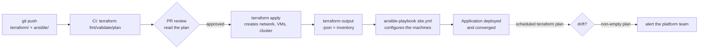

# Module 5 — Infrastructure as Code

> **Day 5 · ~40 minutes of lecture · Labs 13, 14**
>
> **Learning outcomes.** You can define IaC and justify it in business terms; distinguish
> declarative from imperative and provisioning from configuration management; explain
> Terraform's plan/apply cycle, state file and locking, and why state is the most dangerous
> file in your organisation; write variables, outputs and modules; and write an idempotent
> Ansible playbook with inventory, roles and handlers.

---

## 5.1 Infrastructure as Code — principles

### The definition

> **Infrastructure as Code (IaC)** — the practice of defining and managing infrastructure
> (networks, machines, clusters, load balancers, DNS, policy) in **machine-readable
> definition files that are version-controlled and applied by automation**, rather than
> through manual configuration or interactive tools.

The key phrase is *version-controlled*. A script that builds a server is automation. A
**versioned, reviewed, tested, reproducible** definition of the desired infrastructure —
where the repository is the source of truth and drift is detectable — is IaC.

### The problem it solves: snowflakes and configuration drift

> **Snowflake server** — a server whose exact configuration is unique, undocumented, and
> the product of accumulated manual changes. It cannot be rebuilt, so it can never be
> safely patched or replaced.
>
> **Configuration drift** — the gradual divergence of the real environment from its
> intended definition, caused by manual changes, failed automation and emergency fixes.

```
         WITHOUT IaC                                    WITH IaC
 ┌────────────────────────────────┐        ┌────────────────────────────────────┐
 │ Wiki page: "How to build prod" │        │ git repo:  terraform/  ansible/    │
 │  (last edited 2021, wrong)     │        │  ├─ reviewed via pull request      │
 │ Manual console clicks          │        │  ├─ plan output attached to the PR │
 │ "Ask Thabo, he built it"       │        │  ├─ applied only by the pipeline   │
 │ Rebuild time: 3 days, if ever  │        │  └─ rebuild time: one apply        │
 │ Dev ≠ staging ≠ prod           │        │ Same modules, different variables  │
 │ No audit trail                 │        │ Full git history = the audit trail │
 └────────────────────────────────┘        └────────────────────────────────────┘
```

### The principles

| Principle | Definition | Why it matters |
|---|---|---|
| **Declarative over imperative** | Describe the **desired end state**, not the steps | The tool computes the diff; the same file works whether you are creating or updating |
| **Idempotency** | Applying N times gives the same result as applying once | Safe to re-run after a partial failure — the foundation of all automation |
| **Immutable infrastructure** | Never modify a running server; replace it with a new one built from the new definition | Eliminates drift entirely; every server is identical to its definition |
| **Version control everything** | Definitions live in git, changed via PR | Review, audit, blame, revert |
| **Reproducibility** | Same inputs → same infrastructure | Environments are comparable; disasters are recoverable |
| **Composition & reuse** | Modules/roles with inputs and outputs | One reviewed network module, used ten times |
| **Test infrastructure code** | Validate, lint, plan, policy-check, integration-test | It is code; it has bugs; those bugs are outages |

### Declarative vs imperative

```
 IMPERATIVE  (how)                        DECLARATIVE (what)
 ─────────────────────────────────        ────────────────────────────────────────
 if ! id appuser; then                    resource "docker_container" "app" {
   useradd appuser                          name  = "paytrack-api"
 fi                                         image = "paytrack-api:1.4.2"
 mkdir -p /opt/app                          restart = "unless-stopped"
 chown appuser /opt/app                   }
 docker run -d --name paytrack-api …
                                          The tool reads current state, computes the
 You own every conditional and every       difference, and performs only what is needed.
 edge case. Re-running is unsafe unless    Re-running is safe by construction.
 you wrote every guard correctly.
```

Ansible is interesting here: its *syntax* looks like a list of steps, but each **module** is
written to be declarative and idempotent (`state: present`). You describe desired state per
task; Ansible checks before it acts.

### Mutable vs immutable infrastructure

| | **Mutable** ("pets") | **Immutable** ("cattle") |
|---|---|---|
| Update method | SSH in, patch, restart | Build a new image/container, replace, delete the old |
| Drift | Accumulates | Impossible — nothing is ever modified |
| Rollback | Undo the change, hope | Redeploy the previous artefact |
| Debugging | Log in and poke | Reproduce from the definition |
| Fits | Long-lived stateful hosts | **Containers, Kubernetes, cloud instances** |

Containers made immutable infrastructure the default — which is why days 3 and 4 come
before this module.

### Provisioning vs configuration management

```
 ┌──────────────────────────────┐        ┌──────────────────────────────────────┐
 │  PROVISIONING                │        │  CONFIGURATION MANAGEMENT            │
 │  "Make the thing exist"      │  ───►  │  "Make the thing correct inside"     │
 │  Terraform · OpenTofu ·      │        │  Ansible · Puppet · Chef · Salt      │
 │  CloudFormation · Pulumi     │        │                                      │
 │  VPCs, VMs, clusters, DNS,   │        │  packages, users, files, services,   │
 │  load balancers, databases   │        │  kernel params, app deployment       │
 └──────────────────────────────┘        └──────────────────────────────────────┘
```

The boundary blurs (Terraform can install a Helm chart; Ansible can create a VM), but the
tools are optimised for different jobs. The common pattern — and the one you will build in
Labs 13 and 14 — is **Terraform provisions, Ansible configures.**

---

## 5.2 Terraform fundamentals

> **Terraform** — an IaC tool that uses a declarative language (HCL) and a plugin
> architecture of **providers** to create, update and destroy infrastructure, tracking what
> it manages in a **state file**.

> **Licence note.** Terraform moved to the BUSL licence in 2023. It remains free for the use
> in this course and for the overwhelming majority of internal enterprise use; the
> restriction targets competing hosted products. **OpenTofu** is the MPL-licensed fork under
> the Linux Foundation and is command-line compatible — every command in Lab 13 works with
> `tofu` in place of `terraform`.

### Core objects

| Block | Purpose | Example |
|---|---|---|
| `terraform {}` | Required versions, required providers, backend | Pin everything |
| `provider "x" {}` | Configures a plugin that talks to an API | `docker`, `kubernetes`, `aws` |
| `resource "type" "name" {}` | **A thing Terraform creates and owns** | `docker_container.app` |
| `data "type" "name" {}` | **Reads** something Terraform does *not* own | Look up an existing image |
| `variable "name" {}` | Typed input, optionally with default and validation | `replica_count` |
| `output "name" {}` | Value exposed after apply, and to parent modules | The service URL |
| `locals {}` | Named intermediate expressions | `local.common_labels` |
| `module "name" {}` | Reusable group of resources | `module.paytrack_app` |

### The workflow

```
 ┌──────────┐  ┌──────────┐  ┌──────────┐  ┌─────────────────┐  ┌──────────┐  ┌──────────┐
 │  write   │─►│   init   │─►│ validate │─►│      plan       │─►│  apply   │─►│ destroy  │
 │  .tf     │  │ download │  │ + fmt    │  │  READ-ONLY diff │  │ execute  │  │ tear down│
 │          │  │ providers│  │          │  │  desired vs     │  │ the plan │  │          │
 │          │  │ + backend│  │          │  │  state vs real  │  │          │  │          │
 └──────────┘  └──────────┘  └──────────┘  └─────────────────┘  └──────────┘  └──────────┘
                                                  │
                          ┌───────────────────────┴────────────────────────┐
                          │  + create   ~ update in-place                   │
                          │  - destroy  -/+ replace (destroy then create)   │
                          └────────────────────────────────────────────────┘
```

**`terraform plan` is the most important command in this module.** It is a read-only dry run
that tells you exactly what would change. The professional workflow is: plan runs on every
pull request, its output is attached to the PR, a human reviews it, and only then does the
pipeline apply. Reading a plan carefully — especially spotting an unintended `-/+ replace`
on a database — is a skill that prevents real outages.

```bash
terraform plan -out=tfplan     # save the exact plan
terraform apply tfplan         # apply EXACTLY that plan — no re-evaluation, no surprises
```

### State — the most dangerous file you own

> **State file** (`terraform.tfstate`) — Terraform's record of the mapping between the
> resources in your configuration and the real objects that exist, plus cached attribute
> values and dependency metadata.

Terraform needs it because most APIs cannot tell you "which of these did you create?" State
answers three questions: what do I manage, what were its attributes last time, and in what
order must things be created and destroyed.

**Four rules:**

1. **Never edit it by hand.** Use `terraform state mv|rm|show` and `terraform import`.
2. **It contains secrets in plaintext** — database passwords, generated keys, certificate
   material. **Never commit it to git.** Encrypt it at rest.
3. **Use a remote backend** for anything shared (S3 + DynamoDB, Azure Storage, GCS,
   Terraform Cloud, or Postgres). Local state means one laptop is your source of truth.
4. **State locking is mandatory for teams.** Two concurrent applies against one state
   corrupt it. Remote backends provide locking; local ones do not.

```
   LOCAL STATE (Lab 13 — fine for learning)      REMOTE STATE (production)
   ┌────────────────────────┐                    ┌──────────────────────────────┐
   │ ./terraform.tfstate    │                    │  S3 bucket (versioned,       │
   │  ✗ one laptop          │                    │  encrypted) + DynamoDB lock  │
   │  ✗ no locking          │                    │   ✓ shared  ✓ locked         │
   │  ✗ secrets on disk     │                    │   ✓ versioned  ✓ auditable   │
   └────────────────────────┘                    └──────────────────────────────┘
```

> **Drift detection:** `terraform plan` on unchanged code that still shows changes means
> someone modified the real infrastructure by hand. Run it on a schedule and alert on a
> non-empty plan — that is your drift detector.

### Variables, precedence and outputs

```hcl
variable "replica_count" {
  description = "Number of PayTrack API replicas"
  type        = number
  default     = 2
  validation {
    condition     = var.replica_count >= 1 && var.replica_count <= 20
    error_message = "replica_count must be between 1 and 20."
  }
}

output "app_url" {
  value       = "http://localhost:${docker_container.app.ports[0].external}"
  description = "Where to reach PayTrack API"
  sensitive   = false                  # `true` masks it in CLI output (NOT in state)
}
```

Precedence, **lowest to highest**: `default` → `terraform.tfvars` → `*.auto.tfvars`
(alphabetical) → `-var-file=` → `-var=` → `TF_VAR_name` environment variable.

### Modules

> **Module** — a directory of `.tf` files used as a reusable component with inputs
> (variables) and outputs.

```
 terraform/
 ├── main.tf                    ← the ROOT module
 ├── variables.tf
 ├── outputs.tf
 └── modules/
     └── paytrack-app/             ← a child module
         ├── main.tf
         ├── variables.tf       (inputs)
         └── outputs.tf         (outputs)
```

```hcl
module "paytrack_dev" {
  source        = "./modules/paytrack-app"
  environment   = "dev"
  replica_count = 1
}
module "paytrack_prod" {
  source        = "./modules/paytrack-app"
  environment   = "prod"
  replica_count = 3
}
```

One reviewed definition, two environments that cannot silently diverge. Guidelines: keep
modules small and single-purpose, version them (`?ref=v1.2.0` for git sources), never
hard-code environment names inside a module, and always pin `required_version` and
`required_providers`.

### Meta-arguments worth knowing

| Argument | Purpose |
|---|---|
| `count = 3` | Create N copies; indexed `[0]`, `[1]`… Removing one **re-indexes and can destroy the wrong resource** |
| `for_each = toset([...])` | Create one per key. **Prefer this to `count`** — keys are stable |
| `depends_on` | Explicit ordering when Terraform cannot infer it |
| `lifecycle { prevent_destroy = true }` | Refuse to destroy (databases!) |
| `lifecycle { create_before_destroy = true }` | Avoid downtime on replacement |
| `lifecycle { ignore_changes = [tags] }` | Tolerate out-of-band changes to specific attributes |

---

## 5.3 Ansible fundamentals

> **Ansible** — an agentless configuration-management and automation tool that connects to
> managed nodes over SSH (or WinRM, or a local/container connection), pushes small programs
> called **modules**, executes them to bring the node to a described state, and removes them.

### Why "agentless" matters

```
        AGENT-BASED (Puppet, Chef)                 AGENTLESS (Ansible)
 ┌────────────────────────────────┐        ┌──────────────────────────────────┐
 │ Install + run + patch an agent │        │ Requires only SSH + Python on    │
 │ on EVERY managed node          │        │ the target — already there on    │
 │ Agent polls a master (PULL)    │        │ Ubuntu                           │
 │ Master = extra infrastructure  │        │ Control node PUSHES on demand    │
 │ Bootstrap problem: who         │        │ Nothing to bootstrap, nothing    │
 │ installs the agent?            │        │ left behind                      │
 └────────────────────────────────┘        └──────────────────────────────────┘
```

Trade-off: pull-based systems continuously self-correct drift; Ansible only corrects drift
when you run it. The usual answer is to run the playbook on a schedule or from CI.

### The building blocks

| Concept | Definition |
|---|---|
| **Control node** | The machine you run `ansible-playbook` from. Never Windows |
| **Managed node** | A host being configured. Needs SSH + Python; **no agent** |
| **Inventory** | The list of managed nodes, organised into groups, with variables |
| **Module** | A unit of work (`apt`, `copy`, `service`, `user`, `docker_container`). **Idempotent by design** |
| **Task** | One invocation of a module, with a human-readable `name` |
| **Play** | A mapping of a group of hosts to a list of tasks |
| **Playbook** | A YAML file containing one or more plays |
| **Role** | A standard directory structure packaging tasks, handlers, templates, files, vars and defaults for reuse |
| **Handler** | A task that runs **only when notified**, and only **once** at the end of the play — e.g. "restart nginx" |
| **Facts** | Data auto-gathered from the target (`ansible_facts`) — OS, IPs, memory, CPU |
| **Collection** | A distributable bundle of roles, modules and plugins (Ansible Galaxy) |
| **Vault** | Built-in encryption for secrets stored in the repository |

### Inventory

```ini
# inventory/hosts.ini
[web]
web1 ansible_host=192.168.56.11
web2 ansible_host=192.168.56.12

[db]
db1 ansible_host=192.168.56.21

[production:children]
web
db

[all:vars]
ansible_user=ubuntu
ansible_python_interpreter=/usr/bin/python3
```

YAML inventories and **dynamic inventory** (a script or plugin that queries AWS, Azure or
the Docker API for the live host list) are both supported. Dynamic inventory is what makes
Ansible work with autoscaling infrastructure — you never maintain a static host list.

### An annotated playbook

```yaml
- name: Baseline configuration for PayTrack API hosts
  hosts: web                      # which inventory group
  become: true                    # escalate to root via sudo
  gather_facts: true              # collect ansible_facts (costs ~1-2 s per host)
  vars:
    app_user: paytrack
    app_port: 8080

  tasks:
    - name: Ensure required packages are present
      ansible.builtin.apt:        # fully-qualified collection name (FQCN) - best practice
        name: [curl, jq, ca-certificates]
        state: present            # DESIRED STATE, not "install"
        update_cache: true
        cache_valid_time: 3600
      # Idempotent: on the second run this reports "ok", not "changed".

    - name: Ensure the application user exists
      ansible.builtin.user:
        name: "{{ app_user }}"
        shell: /usr/sbin/nologin
        system: true

    - name: Render the application config from a template
      ansible.builtin.template:
        src: app.conf.j2          # a Jinja2 template
        dest: /etc/paytrack/app.conf
        owner: "{{ app_user }}"
        mode: "0640"
      notify: Restart paytrack       # fires the handler ONLY if this task changed something

    - name: Ensure the service is running and enabled at boot
      ansible.builtin.service:
        name: paytrack
        state: started
        enabled: true

  handlers:
    - name: Restart paytrack
      ansible.builtin.service:
        name: paytrack
        state: restarted
      # Runs ONCE at the end of the play, no matter how many tasks notified it.
```

### Idempotency, and how to verify it

Ansible's output is the proof:

```
PLAY RECAP
web1 : ok=7  changed=3  unreachable=0  failed=0   ← first run
web1 : ok=7  changed=0  unreachable=0  failed=0   ← second run: NOTHING changed
```

**A second run showing `changed=0` is the definition of an idempotent playbook.** If a task
reports `changed` every time, it is almost always a raw `command`/`shell` task. Fix it with
a proper module, or add `creates:`, `removes:` or `changed_when:`.

```yaml
- name: Initialise the database schema (only once)
  ansible.builtin.command: /opt/paytrack/migrate.sh
  args:
    creates: /var/lib/paytrack/.migrated     # skip entirely if this file exists
```

### Role structure

```
 roles/
 └── paytrack_app/
     ├── defaults/main.yml     lowest-precedence variables — the role's public API
     ├── vars/main.yml         high-precedence internal variables
     ├── tasks/main.yml        the entry point
     ├── handlers/main.yml     restart/reload handlers
     ├── templates/            Jinja2 (.j2) files
     ├── files/                static files to copy
     ├── meta/main.yml         dependencies, Galaxy metadata
     └── README.md
```

Roles are Ansible's unit of reuse, exactly as modules are Terraform's. `defaults/` is the
documented interface; `vars/` is internal.

### Ansible Vault — secrets in the repository, safely

```bash
ansible-vault encrypt group_vars/production/secrets.yml   # encrypt a file
ansible-vault view   group_vars/production/secrets.yml    # read without decrypting on disk
ansible-playbook site.yml --ask-vault-pass                 # or --vault-password-file
```
Encrypted files are safe to commit. The password itself must come from outside git — a
CI secret, a password manager, or a key-management service.

### Useful execution flags

| Flag | Effect |
|---|---|
| `--check` | Dry run — report what *would* change (Ansible's `terraform plan`) |
| `--diff` | Show the actual file-content differences |
| `--limit web1` | Run against a subset of hosts |
| `--tags deploy` / `--skip-tags` | Run only tagged tasks |
| `-vvv` | Verbose; shows the module arguments and the SSH commands |
| `--start-at-task "name"` | Resume a long playbook mid-way |
| `--syntax-check` | Parse only |
| `ansible-lint playbook.yml` | Catch bad practice before it reaches a host |

---

## 5.4 Terraform and Ansible together

They are complements, not competitors. The reference pattern:



| Use Terraform for | Use Ansible for |
|---|---|
| Creating cloud/network/cluster resources | Installing and configuring packages on machines |
| Anything with a lifecycle you must track and destroy | Anything about the *inside* of a machine |
| Dependency graphs across many APIs | Ordered, procedural operational runbooks |
| Environments as reusable modules | Orchestrating a rolling restart across a fleet |

**The honest boundary:** in a fully containerised, Kubernetes-based platform, Ansible's
classic role shrinks — the container image *is* the configuration management. Ansible
remains valuable for node baselines, appliances, network devices, legacy VMs, and
operational runbooks that must be repeatable. Say this to your delegates; they will meet
both worlds.

---

## 5.5 IaC anti-patterns

```
 ✗ ClickOps then "import later"     — the console change is never imported; drift is permanent
 ✗ Local state on one laptop        — a lost laptop means losing control of production
 ✗ State committed to git           — plaintext secrets in every clone, forever
 ✗ One giant root module            — a 40-minute plan; a typo can destroy everything
 ✗ No `plan` review before `apply`  — you find out what changed by reading the incident report
 ✗ Hard-coded secrets in .tf files  — they end up in git AND in state
 ✗ Unpinned provider/module versions— a provider release silently changes your infrastructure
 ✗ `terraform apply -auto-approve` from a laptop — no review, no audit, no second pair of eyes
 ✗ Manual "just this once" SSH fix  — the fix is not in code, so the next apply reverts it
 ✓ Small modules · remote locked state · plan in the PR · apply only from CI · pin everything
```

---

## 5.6 Key terms

| Term | Definition |
|---|---|
| **IaC** | Infrastructure defined in versioned, machine-readable files applied by automation |
| **Declarative / Imperative** | Describe the end state / describe the steps |
| **Idempotent** | Repeating the operation does not change the result |
| **Drift** | Divergence between the definition and reality |
| **Snowflake** | A uniquely, manually configured, unreproducible server |
| **Immutable infrastructure** | Replace rather than modify |
| **Provisioning / Configuration management** | Create the resource / configure inside it |
| **Provider** | Terraform plugin that talks to a specific API |
| **Resource / Data source** | Something Terraform owns / something it only reads |
| **Plan / Apply** | Read-only diff / execute the diff |
| **State / Backend / Locking** | Terraform's record / where it is stored / concurrency protection |
| **Module (TF) / Role (Ansible)** | The unit of reuse in each tool |
| **Inventory** | Ansible's list of managed hosts and groups |
| **Play / Task / Handler** | Hosts+tasks mapping / one module call / a task run only when notified |
| **Facts** | Data gathered from a managed node |
| **Ansible Vault** | Built-in encryption for repository-stored secrets |
| **Check mode (`--check`)** | Ansible's dry run |

---

## 5.7 Module 5 self-check

1. Define idempotency and give one Terraform and one Ansible example.
2. Why must `terraform.tfstate` never be committed to git? Give two distinct reasons.
3. `terraform plan` on unchanged code shows a change. What has happened, and what should
   you do?
4. Your plan shows `-/+ replace` on a production database resource. What do you do next?
5. Why should you prefer `for_each` over `count`?
6. An Ansible playbook reports `changed=6` on every run. What is likely wrong, and how do
   you fix it?
7. Where is the boundary between Terraform and Ansible in a Kubernetes-based platform?
8. Your team applies Terraform from laptops with `-auto-approve`. Name three risks and the
   target workflow.

---

**Next:** [Module 6 — Continuous Delivery and Release Automation](module-06-continuous-delivery.md)
· Labs: [13](../../labs/lab-13-terraform-iac/README.md) ·
[14](../../labs/lab-14-ansible-config-mgmt/README.md)
