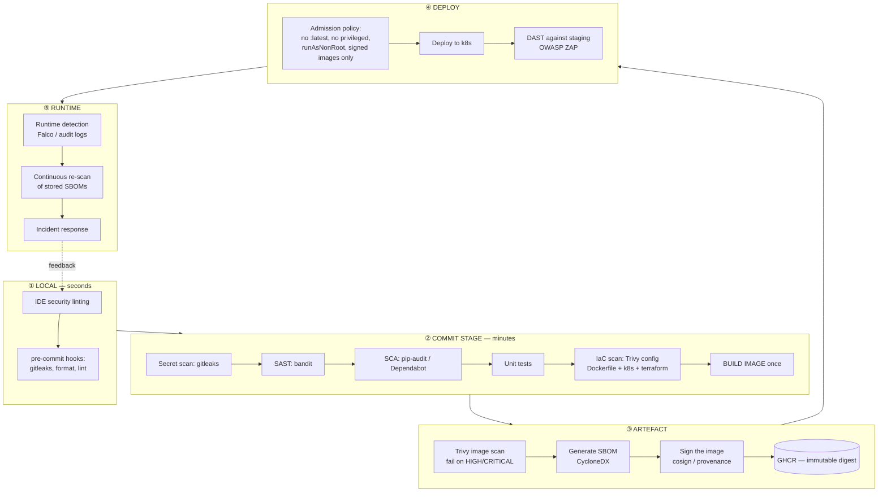

# Module 7 — DevSecOps

> **Day 6 · ~25 minutes of lecture · Lab 17**
>
> **Learning outcomes.** You can explain why security must move into the pipeline rather
> than sit at the end of it; name and place each class of security testing (SAST, SCA, DAST,
> IAST, secret scanning, IaC scanning, image scanning); design a secure CI/CD pipeline
> including its own supply-chain risks; choose a secret-management approach; and apply
> container and Kubernetes hardening.

---

## 7.1 What DevSecOps is

> **DevSecOps** — the integration of security practices, tooling and ownership into every
> stage of the DevOps lifecycle, such that security is **continuous, automated and shared**
> rather than a manual gate performed at the end by a separate team.

The driver is arithmetic. Traditional security review is a serial, manual step performed by
a scarce team, at the point where change is most expensive to make:

```
   ~1 security engineer  :  ~10 operations engineers  :  ~100 developers

   Serial manual review at the end cannot possibly keep up.
   It becomes either a rubber stamp, or the constraint in your value stream — usually both.
```

### The cost curve

```
 Relative cost to fix a defect (order-of-magnitude, and the same shape for security bugs)

  ████████████████████████████████████████████████  PRODUCTION (breach: + regulatory,
  ██████████████                                    reputational, legal)
  ██████                                            staging / pen-test
  ██                                                CI pipeline
  █                                                 IDE / pre-commit
  ───────────────────────────────────────────────────────────────────────
  design    code    build     test     deploy    production
     ◄──────── shift LEFT ────────
```

> **Shift left** — moving quality and security activities as early in the lifecycle as
> possible, where defects are cheapest to find and fix and where the author still has the
> full context.

But shift left is only half of it. **You also shift right**: runtime security, anomaly
detection, and production feedback. The modern phrasing is *"shift left AND extend right"* —
security is continuous across the whole loop.

### The DevSecOps principles

| Principle | Meaning |
|---|---|
| **Security is everyone's job** | The authoring team owns the security of what they ship, supported by a security *platform* team |
| **Automate security testing** | If it is not in the pipeline it will not happen consistently |
| **Fail the build on real risk** | A warning nobody reads is not a control |
| **Secure by default** | The paved road is the secure road — hardened base images, templates, policies |
| **Least privilege everywhere** | Humans, pipelines, service accounts, containers |
| **Assume breach** | Design for containment and detection, not only prevention |
| **Continuous compliance** | Policy as code, evidence generated by the pipeline, not assembled by hand |
| **Blameless security** | A developer who reports their own mistake must be thanked, not punished |

---

## 7.2 The classes of security testing

| Type | Full name | What it examines | When | Finds | Misses | Tool used here |
|---|---|---|---|---|---|---|
| **Secret scanning** | — | Repo contents & history | pre-commit, PR | Hard-coded keys, tokens, certificates | Secrets already rotated out | **gitleaks** |
| **SAST** | Static Application Security Testing | Source code, without running it | commit stage | Injection, unsafe deserialisation, weak crypto, hard-coded config | Runtime/config issues; produces false positives | **bandit** |
| **SCA** | Software Composition Analysis | Your **dependencies** and their licences | commit stage | Known CVEs in libraries, licence violations | Bugs in your own code | **pip-audit**, Dependabot |
| **Container scanning** | — | Image layers: OS packages + app deps | after build | Vulnerable base image, vulnerable packages, misconfig, secrets in layers | Logic flaws | **Trivy** |
| **IaC scanning** | — | Terraform/Kubernetes/Dockerfile config | commit stage | Public buckets, privileged containers, open security groups | Runtime drift | **Trivy config**, Checkov, tfsec |
| **DAST** | Dynamic Application Security Testing | The **running** application from outside | staging | Auth flaws, misconfig, real injection, XSS | Anything not reachable via the tested surface | OWASP ZAP |
| **IAST** | Interactive AST | Instrumented app during tests | test stage | Combines static + runtime context, low false positives | Needs an agent and good test coverage | (concept) |
| **Runtime / RASP** | — | Live production behaviour | production | Exploitation attempts, anomalous syscalls | — | Falco (concept) |

**The complementarity is the point:** SAST reads your code, SCA reads your dependencies —
and in a typical service **70–90 % of the shipped bytes are dependencies**. A pipeline with
only SAST is checking the small part.

### SBOM — Software Bill of Materials

> **SBOM** — a formal, machine-readable inventory of every component in a piece of software,
> with versions and, ideally, provenance. Standard formats: **SPDX** and **CycloneDX**.

When Log4Shell (CVE-2021-44228) landed, the organisations that answered *"are we affected,
and where?"* in hours rather than weeks were the ones with SBOMs. It is now a procurement
and regulatory expectation (US Executive Order 14028, the EU Cyber Resilience Act).

Generate one per build, store it with the artefact, and **re-scan stored SBOMs when new
CVEs are published** — the vulnerability in the image you shipped last month was not known
last month.

---

## 7.3 The secure pipeline



### Gating policy — where teams get this wrong

Failing the build on every finding produces a pipeline that is always red, and a team that
learns to bypass it. Failing on nothing produces a dashboard nobody reads. Use a
**risk-tiered policy**:

| Finding | Action |
|---|---|
| Secret detected in code | **Fail immediately. Rotate the secret.** No exceptions |
| CRITICAL vuln **with a fix available** | **Fail the build** |
| HIGH vuln with a fix available | Fail on `main`/release; warn on feature branches |
| HIGH/CRITICAL with **no fix available** | Warn + record an accepted risk with an expiry date and an owner |
| MEDIUM / LOW | Report to a dashboard; fix in planned work |
| Known false positive | Suppress **with a comment giving the reason and an expiry**, in the repo |

Two practices keep this honest: **`.trivyignore` / suppression entries must have an owner
and an expiry date**, and a **grace period for newly published CVEs** so that a CVE
disclosed at 02:00 does not block an unrelated hotfix at 09:00.

---

## 7.4 Securing the pipeline itself

The CI/CD system is a high-value target: it holds credentials to everything and it executes
code by design. Compromise of the pipeline is compromise of production.
(SolarWinds, Codecov and the `xz-utils` backdoor are the canonical cautionary tales.)

| Risk | Control |
|---|---|
| A malicious or compromised third-party Action/plugin | **Pin `uses:` to a full commit SHA**, not a tag; review before adding; use an allow-list |
| Dependency confusion / typosquatting | Internal package proxy; pinned, hash-checked lockfiles |
| Over-privileged pipeline credentials | Least-privilege `permissions:` block; **short-lived OIDC tokens instead of long-lived secrets** |
| Secrets leaking into logs | Use the platform's secret store (masked); never `echo` a secret; scan logs |
| PRs from forks stealing secrets | Use `pull_request` (not `pull_request_target`) for untrusted code; never expose secrets to fork PRs |
| Tampered artefacts | Sign images (**cosign**) and verify signatures at admission; SLSA provenance attestation |
| Self-hosted runner reuse | Ephemeral runners, one job per runner, isolated network |
| Unreviewed changes to the pipeline itself | `.github/workflows/**` and `Jenkinsfile` in **CODEOWNERS**; branch protection |

> **Concrete rule to take away:** `uses: actions/checkout@v4` is convenient but mutable.
> `uses: actions/checkout@8ade135a41bc03ea155e62e844d188df1ea18608` is what belongs in a
> pipeline that deploys to production. Dependabot can keep the SHAs updated for you.

---

## 7.5 Secret management

> **Secret** — any credential whose disclosure grants access: passwords, API keys, tokens,
> private keys, certificates, connection strings.

### The hierarchy, worst to best

```
 ✗✗✗  Hard-coded in source                  in git forever, in every clone, in every fork
 ✗✗   Committed .env / config file          same problem, slightly better intentions
 ✗    Baked into a container image          `docker history` shows ARG/ENV; layers are extractable
 ~    CI/CD platform secrets                encrypted, masked, scoped — acceptable baseline
 ~    Kubernetes Secret (base64 only)       needs encryption-at-rest + RBAC to mean anything
 ✓    Sealed Secrets / SOPS                 encrypted in git, decryptable only in-cluster
 ✓✓   External secret manager (Vault, cloud KMS, External Secrets Operator)
 ✓✓✓  Short-lived, dynamically generated credentials (OIDC federation, Vault dynamic secrets)
```

**The ideal is a secret that does not exist long enough to be stolen.** OIDC federation —
where the pipeline exchanges a short-lived identity token for a cloud credential valid for
minutes — eliminates the long-lived secret entirely.

### If a secret is committed

1. **Rotate it first.** Assume it is compromised the moment it is pushed; public repos are
   scraped within seconds.
2. Remove it from history (`git filter-repo`, BFG) — but understand this **rewrites
   history** and does not help with forks, clones, or CI caches that already have it.
3. Add detection so it cannot recur: pre-commit gitleaks **and** a CI gate.
4. Check access logs for use of the credential.

**Rotating is mandatory; scrubbing history is cosmetic.** Teams routinely get this backwards
and spend two days rewriting history without rotating the key.

### Sealed Secrets — the GitOps-compatible answer

```
   kubeseal --cert pub.pem            SealedSecret (encrypted)          controller decrypts
  Secret ──────────────────────────►  safe to commit to git ──────────► real Secret in-cluster
  (plaintext, local only)             only THIS cluster can open it
```
The encrypted form is committed; only the controller's private key in the target cluster can
decrypt it. This is what lets "everything in git" coexist with "no plaintext secrets in git".

---

## 7.6 Container and Kubernetes security

### Image security

1. **Minimal base images** — distroless or `-slim`. Fewer packages, fewer CVEs.
2. **Pin by digest**, so you know exactly what you are running.
3. **Multi-stage builds** — no compilers, no source, no build secrets in the shipped image.
4. **Non-root, numeric UID** (`USER 10001`).
5. **Scan in CI and fail on policy.**
6. **Sign images and verify at admission.**
7. **Rebuild regularly** — an image built six months ago accumulates CVEs even if your code
   has not changed. Base-image updates are security work.

### Runtime hardening — the Kubernetes securityContext you should default to

```yaml
securityContext:                     # pod level
  runAsNonRoot: true
  runAsUser: 10001
  fsGroup: 10001
  seccompProfile: { type: RuntimeDefault }
containers:
  - name: app
    securityContext:                 # container level
      allowPrivilegeEscalation: false      # blocks setuid escalation
      readOnlyRootFilesystem: true         # + an emptyDir for anything writable
      capabilities: { drop: ["ALL"] }      # add back only what is genuinely needed
    resources:                              # limits are a security control:
      requests: { cpu: 100m, memory: 128Mi }# they bound a compromised container's
      limits:   { cpu: 500m, memory: 256Mi }# ability to starve its neighbours
```

### The Kubernetes controls that matter most

| Control | Purpose |
|---|---|
| **RBAC, least privilege** | No `cluster-admin` for applications; one ServiceAccount per workload |
| **Namespaces + ResourceQuota + LimitRange** | Blast-radius and noisy-neighbour containment |
| **NetworkPolicy** | **Pod-to-pod traffic is unrestricted by default.** Start with a default-deny ingress policy per namespace |
| **Pod Security Admission** | Enforce the `restricted` profile per namespace |
| **Admission policy** (Kyverno / OPA Gatekeeper) | "No `:latest`", "no privileged", "images only from ghcr.io/our-org", "must have limits" |
| **Encryption at rest for etcd** | Otherwise Secrets are just base64 on a disk |
| **Audit logging** | Who did what to the API server |
| **`automountServiceAccountToken: false`** | Do not hand every pod an API token it does not need |
| **Disable the Docker socket mount** | Equivalent to root on the node |

> 🏦 **The regimes that actually shape a bank's pipeline** — PCI-DSS v4.0 (secure
> development, vulnerability remediation windows, no production PANs in test), **EU DORA**
> (ICT risk, incident-reporting clocks, resilience testing, third-party/ICT risk covering
> your cloud *and* your CI vendor), EBA guidelines, and GDPR — are mapped to concrete
> pipeline controls in
> [Appendix A §A.2](appendix-a-devops-in-a-regulated-bank.md#a2-the-regulations-that-actually-shape-a-delivery-pipeline).
> Note the useful accident that **the best way to reduce PCI scope is to never accept the
> data** — which is why PayTrack API rejects a PAN at the API edge rather than encrypting it.

### OWASP references worth naming in the room

- **OWASP Top 10** — web application risk categories (Broken Access Control is #1).
- **OWASP Top 10 CI/CD Security Risks** — directly relevant to §7.4.
- **CIS Benchmarks** — for Docker and Kubernetes; the standard hardening checklist and what
  most auditors actually compare you against.
- **SLSA** — a framework of levels for supply-chain integrity (provenance, build isolation).

---

## 7.7 Key terms

| Term | Definition |
|---|---|
| **DevSecOps** | Security integrated continuously and automatically across the DevOps lifecycle |
| **Shift left / extend right** | Move security earlier *and* into runtime |
| **SAST / DAST / IAST / SCA** | Static code / running app / instrumented app / dependency analysis |
| **Secret scanning** | Detecting credentials in code and history |
| **IaC scanning** | Detecting insecure infrastructure definitions |
| **SBOM** | Machine-readable inventory of all components (SPDX, CycloneDX) |
| **CVE / CVSS / KEV** | A catalogued vulnerability / its severity score / CISA's *known exploited* list |
| **Supply-chain attack** | Compromising a dependency or build system rather than the target directly |
| **SLSA** | Supply-chain integrity levels framework |
| **Image signing (cosign)** | Cryptographic proof of image origin, verified at admission |
| **Least privilege** | The minimum permission needed, for the minimum time |
| **OIDC federation** | Exchanging a short-lived identity token for credentials; removes long-lived secrets |
| **Sealed Secret** | A secret encrypted so only the target cluster can decrypt it; safe in git |
| **securityContext** | Kubernetes' per-pod/container privilege and isolation settings |
| **NetworkPolicy** | Kubernetes firewall rules for pod-to-pod traffic |
| **Admission controller** | Policy enforced at object-creation time |
| **Pod Security Admission** | Built-in enforcement of privileged/baseline/restricted profiles |
| **RASP / runtime security** | Detecting and blocking attacks in the running system |

---

## 7.8 Module 7 self-check

1. Your pipeline runs SAST only. What proportion of your risk are you likely missing, and
   why?
2. An API key was committed and pushed to a public repo 20 minutes ago. List your actions
   in order.
3. Why is failing the build on every MEDIUM finding usually counter-productive? What do you
   do instead?
4. `uses: some-org/deploy@main` — state the risk and the fix in one sentence each.
5. Kubernetes Secrets are "encrypted". Correct this and give two production-grade
   alternatives.
6. Your image built six months ago has 40 new CRITICAL CVEs but the code has not changed.
   Explain how, and what practice prevents it.
7. Give three things a NetworkPolicy protects you from that RBAC does not.
8. Why is an SBOM more valuable *after* a build than during it?

---

**Next:** [Module 8 — Monitoring, Logging and Observability](module-08-monitoring-and-observability.md)
· Lab: [17](../../labs/lab-17-devsecops-pipeline/README.md)
